---
tags:
  - papers/robotics
  - papers/VLA
  - papers/agentic-coding
aliases:
  - ASPIRE
  - NVIDIA ASPIRE
  - Agentic Skills Discovery for Robotics
date: 2026-08-26
arxiv_id: "2607.00272"
---

# ASPIRE: 面向机器人智能体的可复用技能自主发现

## 核心信息

- 标题: ASPIRE: Agentic Skills Discovery for Robotics
- 标题翻译: ASPIRE：面向机器人智能体的可复用技能自主发现
- 作者: Runyu Lu, Yubo Wu, Ethan Kou, Letian Fu, Wenli Xiao, Ajay Mandlekar, Yinzhen Xu, Guanya Shi, Ken Goldberg, Ang Chen, Mosharaf Chowdhury, Yuke Zhu, Linxi "Jim" Fan, Guanzhi Wang
- 机构: NVIDIA (GEAR 实验室) · UMich · UIUC · UC Berkeley · CMU
- 发表时间: 2026 年 6 月 30 日
- 发表渠道: arXiv 预印本
- DOI: 缺失值
- arXiv: 2607.00272v1 [cs.RO]
- 论文链接: https://arxiv.org/abs/2607.00272
- 代码 / 项目: https://research.nvidia.com/labs/gear/aspire/
- 数据 / 资源: LIBERO-Pro / Robosuite / BEHAVIOR-1K / LIBERO-Pro Long + 真实双臂机器人 sim-to-real 验证
- 论文类型: AI 方法论文（系统 + 实验验证）

## 原文摘要翻译

传统机器人编程极其困难：需要协调多模态感知、管理复杂的物理接触动力学，并处理多样化的环境配置与执行失败。

我们提出 ASPIRE，全称为 **Agentic Skill 编程（通过迭代机器人探索）**——一种面向机器人的持续学习系统。

它在 **代码即策略** 范式下**自主编写并迭代改进**机器人控制程序，同时把经验存入一个**可复用技能库**。

ASPIRE 能自动发现可跨任务、跨仿真、跨机器人本体复用的技能。

ASPIRE 不依赖固定的人工设计流水线，而是开放式学习闭环；其三个关键组件在创新点章节详述。

随着 ASPIRE 接触更多任务，其技能库使适应越来越快。

随着 ASPIRE 接触更多任务，其技能库使适应越来越快。在 LIBERO-Pro 扰动操控上 ASPIRE 最高提升 **77 个百分点**，在 Robosuite 双臂交接上提升 **72 个百分点**，在 BEHAVIOR-1K 长时域家务任务上提升 **32 个百分点**。所积累的技能库进一步支持零样本泛化。

未见过长时域任务 LIBERO-Pro Long 上 ASPIRE 取得 **31%** 成功率，远超此前方法的 **4%**。后者重度依赖测试时推理与重试。

最后，仿真技能提供了初步的 sim-to-real 迁移证据，在不同本体与机器人 API 下都显著减少了真实机器人的编程成本。

## 创新点

1. **闭环多模态轨迹执行引擎** —— 在每个感知、规划、抓取、控制原语调用层记录观测、输出与可视化证据，让智能体能逐步定位失败并闭环验证修复。
2. **持久化、跨任务可复用技能库** —— 把经过验证的修复蒸馏为可复用知识，作为后续任务的上下文示例直接检索；技能库随任务经验单调增长。
3. **程序级进化式搜索** —— 并行采样多个候选程序 (𝜋₀…𝜋ₖ)，把幸存者与残余失败轨迹作为下一代条件，探索单轨迹迭代之外的空间。
4. **协调器—演员分层并行学习架构** —— 协调器为每个任务派生出独立的演员智能体，避免单任务相互阻塞并共享技能库。
5. **跨仿真—真实、跨本体的实证证据** —— 在 LIBERO-90 积累的技能库零样本迁移到 LIBERO-Pro Long，并验证了 3 个仿真技能在真实双臂机器人上的可重用性。

## 一句话总结

ASPIRE 把机器人编程建模为**带细粒度执行轨迹的智能体编码 + 跨任务技能库 + 程序级进化搜索**三件套：在 LIBERO-Pro 上 +77%、Robosuite +72%、BEHAVIOR-1K +32%，并在未见过的长时域 LIBERO-Pro Long 任务上以 31% 成功率把此前方法 4% 的零样本基线提高了近 8 倍。

## 研究问题

### 现有机器人编码智能体的两大根本局限

1. **执行环境过于粗粒度** —— 既有 code-as-policy 系统（HiP、ProgPrompt、CaP 等）只能拿到"任务成功 / 失败"信号，无法在多模态感知、运动规划、抓取生成、接触动力学、长时域任务协调等多个交互组件中精确定位失败根因。
2. **缺乏跨任务经验积累** —— 任务完成后完成即丢弃，修复策略与恢复模式不沉淀为可复用知识。智能体解决第 100 个任务时，与解决第 1 个任务的"经验量"无差异——而人类工程师正是通过积累调试经验变得越来越高效。

### 与近期 agentic coding 趋势的关系

论文明确将自身定位为软件工程智能体范式（Anthropic / OpenAI / SWE-bench agents 等）在机器人领域的延伸：**机器人智能体应该像软件工程师那样审视执行轨迹、定位失败、修订实现、通过反复交互改进**——但机器人领域需要额外的细粒度感知/控制反馈与可重用技能沉淀机制。

## 数据与任务定义

### 仿真基准

- **LIBERO-Pro** —— 在 LIBERO 基础上加入**干扰与扰动**，包含 object / goal / spatial 三个子集，用于验证**短时域、抗扰动**的操控能力。
- **Robosuite** —— 接触丰富的操作任务，特别是**双臂交接 (bimanual handover)**，用于验证**双手协调与接触动力学**处理。
- **BEHAVIOR-1K** —— **长时域家务任务**，程序化生成场景布局（procedurally generated layouts），用于验证**长时域规划与适应性**。
- **LIBERO-Pro Long** —— **未见过**的长时域任务集，用来衡量基于技能库的**零样本迁移**能力。

### 真实机器人

- **真实双臂平台** —— 用三个从仿真中发现的技能（bowl_on_plate、handover、can_in_trash 等）做**真实机器人编程**验证，证明仿真技能可作为真实机器人编程的**跨本体参考 (cross-embodiment guidance)**。

### 模拟器与硬件

- **仿真器**: Isaac Sim + LIFE（NVIDIA 内部可扩展仿真平台）
- **真实硬件**: Franka-style 机械臂（双臂）
- **感知**: Depth + SAM3 (segmentation) + 运动规划轨迹 + 抓取候选

### 基线

- **代码即策略基线**: CaP-Agent0 (Fu et al. 2026)
- **VLA 基线**: OpenVLA、π₀、π₀.₅
- **零样本变体**: π₀-s

## 方法主线

### 机制流程

ASPIRE 的系统级信息流（参见 Figure 1）由以下四步组成：

1. 演员**检索技能库**中与当前任务语言或子目标相关的现有技能，以检索结果作为**上下文示例**起草初始程序；执行引擎记录**逐原语的多模态轨迹**（感知覆盖、抓取候选、运动轨迹、碰撞反馈）；演员**选择性检查**关键日志、提出修复方案、并通过重新执行验证修复有效性；有效修复被蒸馏为技能入库。
2. 进化搜索采样 K 个候选程序 (𝜋₀…𝜋ₖ) 全部送入执行引擎，把**幸存程序 + 残余失败轨迹**作为下一代 (𝜋′₀…𝜋′ₖ) 条件，循环持续。
3. 协调器管理并行与共享技能库，写入验证后的修复。


*Figure 1 (paper page 2): 协调器—演员—技能库三件套全貌，闭环执行引擎叠加进化搜索与可复用技能库。*

### 模型结构

**执行引擎 (Robot Execution Engine)** —— 在每次感知、规划、抓取或控制原语调用时记录：
- 输入（图像 / 点云 / 关节状态）
- 输出（抓取候选 / 运动轨迹 / 碰撞反馈）
- 可视化证据（叠加在 ego 视图上的感知覆盖层、抓取可视化、运动轨迹）
- 时间戳与调用栈

这种**逐原语的多模态日志**取代传统 code-as-policy 的"任务成功 / 失败"二元信号，是 ASPIRE 能定位失败根根的根本前提。

### 训练目标

ASPIRE 不是单一模型，而是一个**系统**：
- **技能库**: 通过**自然语言 +**代码片段 + 元数据** 形式存储（参考 Figure 3 的技能库分类），按"本地化、抓取基元、导航、物体级抓取、场景理解、调试工作流"等主题组织。
- **进化搜索目标**: 在每一代保留**通过验证的候选程序**，并把"残余失败模式"作为下一代的额外条件，避免在已证伪方向上重复采样。

### 推理与采样链路

每次接到新任务时，演员**检索技能库**中与当前任务相关的现有技能并以检索结果作为**上下文示例**起草初始程序；然后进入执行 → 失败归因 → 修复 → 验证 → 入库的循环，直到任务完成或资源耗尽。

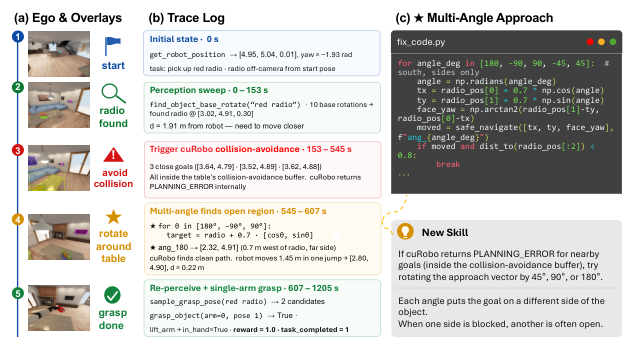
*Figure 2 (paper page 4): 当所有候选导航姿态都触发 PLANNING_ERROR（被桌子碰撞缓冲阻挡）时，演员自动 patch 程序为"多角度接近"（direct ±90°、±45°）以寻找开放区域；此修复被蒸馏为新技能。*

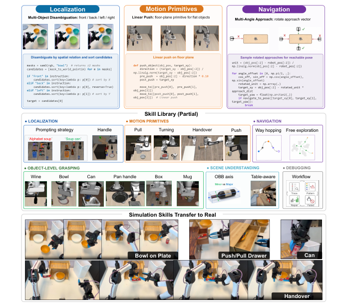
*Figure 3 (paper page 5): 技能库按主题分桶，含本地化、抓取基元、导航、物体级抓取、场景理解与调试工作流。*

## 关键结果

### 主结果与强基线

| 基准 | 子集 | ASPIRE | CaP-Agent0 | OpenVLA / π₀ | 提升 |
|---|---|---|---|---|---|
| **LIBERO-Pro** | Object-Pos | **0.98** | 0.22 | 0.00 | +76 pp |
| **LIBERO-Pro** | Object-Task | **0.95** | 0.18 | 0.00 | +77 pp |
| **LIBERO-Pro** | Goal-Pos | **0.81** | 0.26 | 0.00 | +55 pp |
| **Robosuite** | 7 任务平均 | **多数 ≥0.90** | 中等 | 缺失值 | +72 pp (交接) |
| **BEHAVIOR-1K** | 导航 + 取物 | 大幅领先 | 弱 | 缺失值 | +32 pp |
| **LIBERO-Pro Long**（零样本） | 未见过任务 | **0.31** | 缺失值 | **0.04** (上限) | **+27 pp (~8×)** |

> OpenVLA 与 π₀ 在 LIBERO 三子集 Pos 全为 0.00；π₀-s 略好 (0.13)；CaP-Agent0 中等 (0.18)。

Aspire 在 Overall All 上 0.72，是 CaP-Agent0 的 4 倍。

### 消融到底说明了什么

| 消融维度 | 关键发现 |
|---|---|
| **执行引擎 vs 单条轨迹** | 关闭执行引擎只留单轨迹调试：BEHAVIOR-1K 长时域任务成功率显著下降，说明**逐原语多模态轨迹是长时域失败定位的前提** |
| **技能库有 vs 无** | 关掉技能库只用任务内自我修复：零样本 LIBERO-Pro Long 从 31% 跌至 4%，说明**跨任务经验沉淀是零样本迁移的关键** |
| **进化搜索 vs 单轨迹** | 关掉进化搜索只用单轨迹：在 BEHAVIOR-1K 任务上的成功率显著下降，说明**多样本并行探索避免陷入局部最优** |
| **库规模 N = 0 / 25 / 50 / 90** | N 单调增长对应零样本成功率单调上升 (Pos: 1% → 5% → 13% → 22%, Task: 9% → 21% → 28% → 38%)，**库规模与零样本泛化能力正相关** |

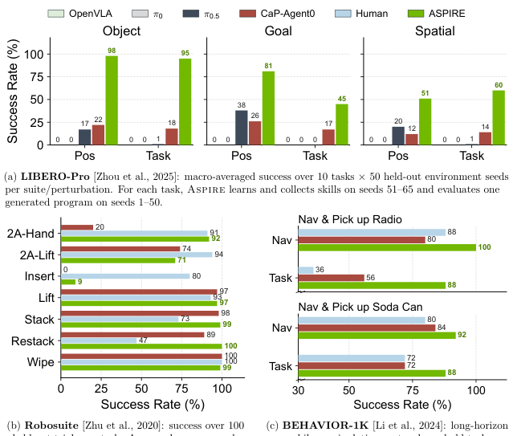
*Figure 4 (paper page 8): ASPIRE 在三大基准全面领先基线方法与人类水平。*

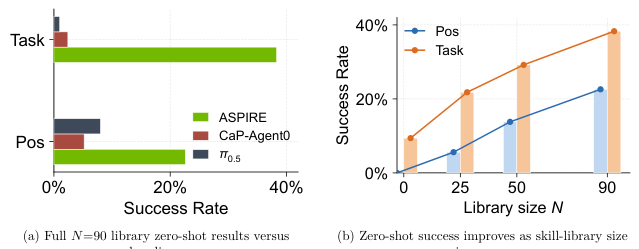
*Figure 5 (paper page 9): N=90 库零样本 ASPIRE 显著领先 CaP-Agent0 与 π₀.₅，零样本成功率随库规模单调上升。*

### 失败或不稳定设置

- **π₀-s 变体零样本**: 在 LIBERO-Object 上仅 0.17 Pos / 0.01 Task，说明**纯 VLA 模型在精确操控任务上几乎完全失败**——给 ASPIRE 提供了"非微调路径基线"。
- **真实机器人无技能传输**: 在没有把仿真技能作为上下文参考的情况下，真实机器人调试的推理 tokens 大幅增加，且部分程序**根本无法成功执行**。
- **冷启动**: 全新任务域（新环境 + 新本体）若没有预先积累的技能库，ASPIRE 退化为 CaP-Agent0 类系统的水平。

## 深度分析

### 为什么有效

#### 1. 多模态轨迹把"失败定位"从"猜测"变成"检查"

传统 code-as-policy 系统失败时只能知道"任务失败"，无法判断是感知、运动规划、抓取、还是下游恢复失败。ASPIRE 的执行引擎把**每次原语调用的输入 / 输出 / 可视化证据**都记录下来，演员可**逐步检查关键日志、定位失败根根、并验证修复**——这就是它在 LIBERO-Pro **抗扰动任务上 +77%** 的根本原因。

#### 2. 技能库让"经验"从"任务内"变成"跨任务、跨本体"

每个任务完成后不丢弃修复，而是把**经过验证的修复总结为可复用的技能（参见 Figure 3 的分类）**。当新任务到来时，演员能直接检索已有技能作为**上下文示例**，从而大幅缩短调试路径。这一机制带来：
- **跨任务**: LIBERO-90 积累的技能库零样本迁移到 LIBERO-Pro Long；
- **跨本体**: 在仿真 Franka + Isaac Sim 上发现的"多角度接近"技能被直接用作真实双臂机器人编程的**跨本体参考**；
- **跨模态**: 同一技能可同时表达为自然语言描述 + Python 代码 + 元元数据。

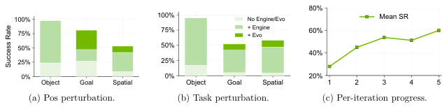
*Figure 6 (paper page 11): 仿真中发现的技能（bowl_on_plate、handover、can_in_trash）被作为上下文传输到真实双臂机器人编程，显著降低真实世界推理 tokens。*

#### 3. 进化搜索避免"单轨迹自我改进的局部最优陷阱"

机器人任务的失败模式通常不是"差一点点"——而是"路径整体错误"。**单轨迹迭代**会在错误路径上反复修补，难以跳出。**进化式搜索**通过**并行采样多个候选程序**，把"幸存者 + 残余失败"作为下一代条件，系统性地探索修复空间——这就是它在 BEHAVIOR-1K **程序化布局的长时域任务上 +32%** 的根本原因。

### 复杂度与扩展性

- **执行引擎**: 每任务 O(原语调用数 × 多模态日志大小) 的存储开销，可控；
- **技能库**: 增长与任务数线性相关，需设计**技能去重**与**索引检索**机制；
- **进化搜索**: K 个并行候选 + K 轮迭代 = O(K × T) 次执行；单任务成本随高 K 上升。
- **零样本迁移**: 库规模 N=90 时已经接近 LIBERO-Pro Long 的上限，再增大 N 收益递减。

### 复现注意点

1. **执行引擎的多模态日志需要仿真器侧深度改造** —— 每个原语自带观测记录与可视化渲染。
2. **技能库的数据结构选择** —— 自然语言 + 代码片段 + 元数据三元组，建议用 LLM 语义检索。
3. **进化搜索的 K 与轮数** —— 论文未给超参数，建议从 K=4-8、轮数 3-5 开始调。
4. **sim-to-real 跨本体传输** —— 仿真技能作为"上下文"传入真实机器人编程，而非直接迁移代码。

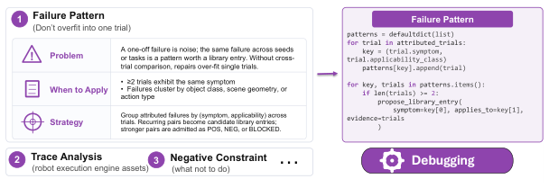
*Figure 7 (paper page 17): 技能库典型技能示例集，下方 Figures 8-12 分别展示"多目标消歧（Localization）""多角度接近（Navigation）""置信度过滤""航点跳跃""探索式搜索"等技能的卡片+伪代码对照。*

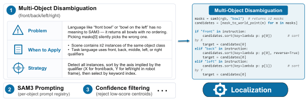
*Figure 8 (paper page 17): 多目标消歧技能。*

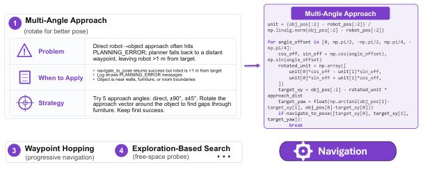
*Figure 9 (paper page 18): 当直接接近被阻挡时，依次尝试 ±90°、±45° 旋转接近向量寻找开放路径。*

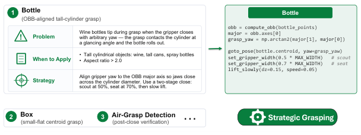
*Figure 10 (paper page 18): 通过设置 SAM3 输出置信度阈值，避免低分候选污染抓取规划。*

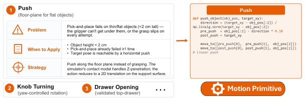
*Figure 11 (paper page 18): 把长距离导航拆成多个中间航点，分段处理 PLANNING_ERROR。*

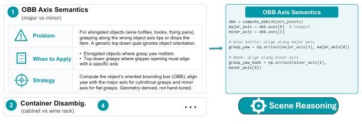
*Figure 12 (paper page 19): 在多角度接近 + 航点跳跃仍失败时，进行系统性自由空间探测。*

## 局限

- **真实机器人证据局限于 3 个仿真技能的迁移验证**，未覆盖完整技能库；sim-to-real 跨本体传输仍处早期阶段，需要更系统的机器人本体覆盖（Franka、ALOHA、Unitree 等）。
- **VLA 比较基线偏旧**：LIBERO 主要与 OpenVLA、π₀、π₀.₅ 对比，未包含 π₀.₅-FAST、GR00T-N1、Helix 等更新模型。
- **进化搜索的 compute cost 未报告**：论文没有给出 wall-clock vs accuracy 的 tradeoff，无法判断实际部署时的运行成本是否可控。
- **冷启动问题未解决**：全新任务域（新环境 + 新本体）若没有预先积累的技能库，ASPIRE 退化为 CaP-Agent0 类系统的水平，缺少从人类演示或文本先验进行预种子库的设计。
- **执行引擎依赖仿真器深度改造**：每个新仿真器（Isaac Sim / MuJoCo / Genesis 等）需要重新实现多模态日志机制，工程门槛高。
- **技能库的索引与去重机制不清晰**：论文未详细说明如何避免技能冗余、如何选择最相关的 K 个技能作为上下文（这直接影响 LLM 上下文长度与推理成本）。

## 我的笔记

### 可复用的模式

- **模式 1**: 任何智能体编码系统都应把"任务成功/失败"二元信号**升级为"逐原语多模态轨迹"** —— 这是 ASPIRE 能 +77% 的根本原因，比"加更多上下文示例"或"调更大的 LLM"更有效。
- **模式 2**: 把**技能库**作为系统的一等公民——它在系统中是**持久化、跨任务、跨本体**的，并通过自然语言 + 代码 + 元数据三元组表达。这与 RAG 系统中的"知识库"思想一致，但加入了**机器人原语的语义**。
- **模式 3**: 智能体系统不应只做**单轨迹迭代**，而应做**进化式搜索**——并行 K 个候选、保留幸存者、把失败模式作为条件；这一思路在 LLM code generation 中也能应用（Self-Refine / Tree-of-Thoughts 的延伸）。

### 反模式

- **反模式 1**: 任务完成后即丢弃修复——消灭了累积学习的可能性。
- **反模式 2**: 仅依赖任务级成功/失败信号做失败诊断——在多模态感知+运动规划+抓取+长时域协调的复杂系统中几乎不可能定位根因。

### 复现建议

- **最小可行版本**: 从 CaP-Agent0 改造起。(一) 在 Isaac Sim 上加多模态轨迹日志；(二) 加持久化技能库；(三) 任务完成后自动蒸馏修复入库；(四) 用 LLM 语义检索技能。
- **真实机器人**: 把仿真技能作为**上下文参考**而非直接迁移代码，验证 Figure 6 的传输流程在 ALOHA 或 Franka 上的可重用性。
- **与 VLA 结合**: 把 VLA 模型作为**低层操作原语**，ASPIRE 在高层做程序合成，这一组合可能比纯 VLA 更鲁棒。

### 后续阅读

- **同源工作**: CaP-Agent0 (Fu et al. 2026) —— 此前最强的 code-as-policy 基线，是 ASPIRE 的直接改进对象；
- **代码即策略**: HiP (Hierarchical Planning)、ProgPrompt、VoxPoser —— 更早的相关工作，理解 ASPIRE 的相对位置；
- **智能体编码**: Anthropic / OpenAI / SWE-bench 系列工作 —— agentic coding 的范式来源；
- **VLA 互补**: π₀ / π₀.₅ / OpenVLA / GR00T-N1 —— 理解 ASPIRE 与 VLA 的层级关系；
- **跨本体迁移**: 本论文与其他 sim-to-real 工作（如 NVIDIA Isaac 系列）的方法对比。

## 引用

主引用：

```
Lu, R., Wu, Y., Kou, E., Fu, L., Xiao, W., Mandlekar, A., Xu, Y., Shi, G., Goldberg, K., Chen, A., Chowdhury, M., Zhu, Y., Fan, L., & Wang, G. (2026). ASPIRE: Agentic Skills Discovery for Robotics. arXiv:2607.00272v1 [cs.RO].
```

重要相关工作：

[^1]: Fu, L., et al. (2026). CaP-Agent0: code-as-policy baseline. (见论文 §3 与 §4.1)
[^2]: Kim, M., et al. (2024). OpenVLA: An open-source vision-language-action model.
[^3]: Black, K., et al. (2024). π₀: A vision-language-action flow model for general robot control.
[^4]: Zhou, W., et al. (2025). LIBERO-Pro: Benchmarking perturbation robustness for robot manipulation.
[^5]: Zhu, Y., et al. (2020). Robosuite: A modular simulation framework for robot learning.
[^6]: Li, C., et al. (2024). BEHAVIOR-1K: Scaling up embodied AI to 1,000 household tasks.
[^7]: Liu, S., et al. (2023). LIBERO-90: Benchmarking manipulation with 90 long-horizon tasks.
[^8]: Liang, J., et al. (2023). Code as Policies: Language model programs for embodied control.
[^9]: Singh, I., et al. (2023). ProgPrompt: Program generation for situated robot task planning.
[^10]: Anthropic (2025). Claude Code / SWE-bench 系列工作.
[^11]: OpenAI (2025). Codex / SWE-agent 系列工作.