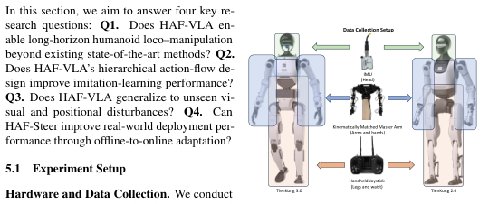
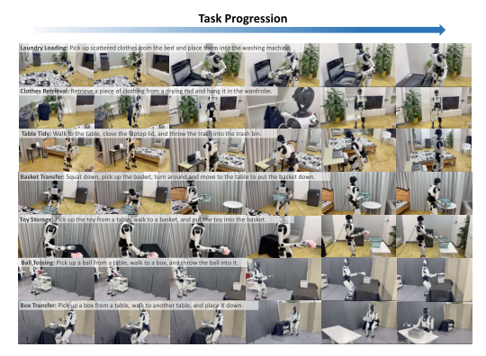
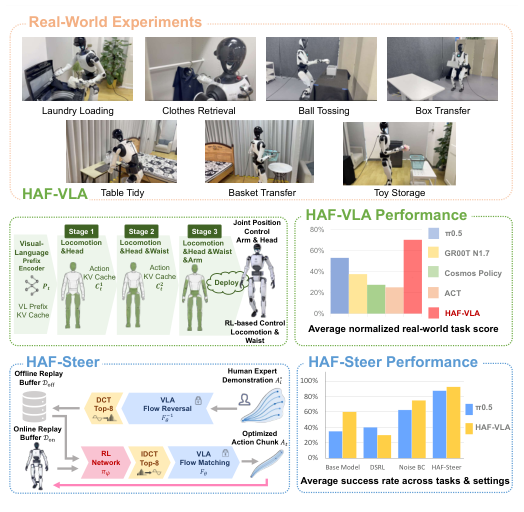
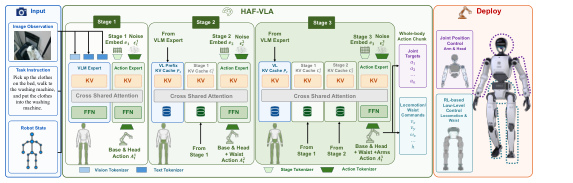
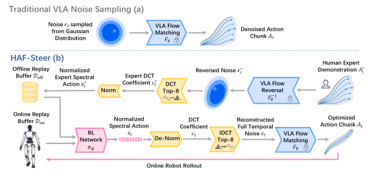
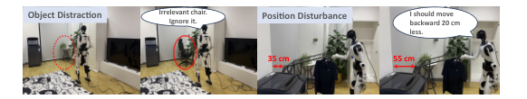
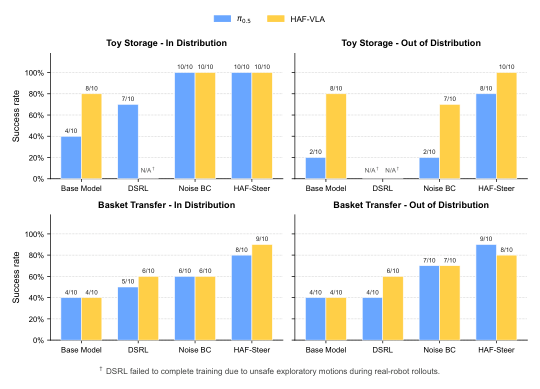

---
tags:
  - papers/robotics/vla
  - papers/embodied-ai
  - papers/humanoid
  - papers/reinforcement-learning
aliases:
  - HAF
  - Humanoid Adaptation Framework
date: 2026-08-17
arxiv_id: "2608.16837"
---

# HAF：用分层动作流与谱潜空间 RL 把通用 VLA 适配到人形全身运动-操作

## 核心信息

- 标题: HAF: Adapting Generalist VLAs to Humanoid Whole-Body Loco-manipulation via Hierarchical Action Flow and Spectral Latent RL
- 标题翻译: 用分层动作流与谱潜空间强化学习把通用视觉语言动作模型适配到人形机器人全身运动-操作
- 作者: Langzhe Gu、Chengkai Hou、Meng Li、Xinhua Wang、Jiaming Liu 等 17 人（首三位并列一作）
- 机构: 北京大学计算机学院多媒体信息处理国家重点实验室；北京人形机器人创新中心；南开大学；西安交通大学
- 发表时间: 2026-08-17
- 发表渠道: arXiv
- DOI: 10.48550/arxiv.2608.16837
- arXiv: 2608.16837
- 论文链接: https://arxiv.org/abs/2608.16837
- 代码 / 项目: https://grange007.github.io/HAF/
- 数据 / 资源: 7 个真实家庭 loco-manipulation 任务，每任务 120 条同构遥操作轨迹（包含视觉干扰与位姿漂移两种 OOD 设置）
- 论文类型: 人形机器人方法论文（方法 + 真实硬件评测）

## 原文摘要翻译

人形机器人在以人为中心的环境中有望成为通用代理，但通用视觉语言动作（VLA）基础模型难以直接用于全身运动-操作。
人形动作的高维与强耦合让传统单阶段 VLA 难以同时协调移动、腰部姿态与双臂操作。
纯离线行为克隆得到的策略在实际部署中又常常不是最优。
在线强化学习可以通过真实交互精调策略，但直接微调大型 VLA 主干又算力昂贵，且真实机器人探索可能带来安全风险。
针对这些瓶颈，本文提出 HAF（人形适配框架）。
HAF 由 HAF-VLA 与 HAF-Steer 两部分组成，把现成的通用 VLA 基础模型迁移到人形全身运动-操作。
HAF-VLA 是建立在预训练流匹配 VLA 之上的分层动作流生成器：它把全身动作的去噪拆为三阶段，配合阶段嵌入和跨阶段键值缓存来保留运动学依赖，避免一次性生成带来的全身动作不连贯。
HAF-Steer 在冻结的 HAF-VLA 之上是一条潜空间离线到在线强化学习流水线：利用流匹配的可逆性与基于 DCT 的降维，把强化学习优化约束在一个紧凑的噪声子空间内，并训练一个带正则化的 SAC 策略。
这样既不需要更新庞大的 VLA 主干，又能在真实机器人上完成高效的策略精调。
在七个真实人形 loco-manipulation 任务上的评测表明，HAF 显著超过了单阶段视觉语言动作基线，并改善了全身协调性与任务表现。

## 创新点

1. **把通用 VLA 改造为分层动作流生成器而不是重训一个人形专属基础模型。** HAF-VLA 直接复用 π0.5 的预训练权重，仅靠「先底盘后上肢」的阶段顺序与跨阶段键值缓存就在 Box Transfer 等任务上比最强基线再涨 30+ 个百分点，且不需要人形专属的大规模预训练数据。
2. **利用流匹配的可逆性把专家动作回放到低维噪声空间，再用 DCT 时间压缩构造可被强化学习高效优化的谱潜空间。** 这一做法在不更新 VLA 主干的前提下恢复了时序变化能力，避免了 DSRL 那种「重复单噪声向量」导致的不安全探索。
3. **混合离线在线 SAC + 仅对离线批次施加行为克隆正则化的训练配方。** 离线数据负责稳定早期策略学习，在线交互负责适应部署时分布漂移；离线采样比例随训练逐步衰减，最终把优化推向真实机器人经验。
4. **围绕归一化分任务评分（normalized task score）的真实评测协议。** 把每个任务拆成 milestone 子目标并归一化，覆盖 7 个长程家庭任务 × 5 个方法 × 10 次执行，再补上视觉椅子干扰与 −20cm 起始位移两个分布外设置，比单纯的通过/失败更能区分阶段完成度。
5. **「结构化生成 + 轻量适配」的双层互补设计。** HAF-VLA 在「结构化生成」层面重塑动作生成结构，HAF-Steer 在「轻量适配」层面冻结主干做微调，二者层次清晰、可单独替换，便于迁移到其他 humanoid 平台或 VLA 主干。

## 一句话总结

HAF 把「把通用 VLA 适配到 humanoid 全身」拆成两个独立问题分别解决：
HAF-VLA 用按运动学依赖递进的三阶段动作流重塑「动作如何生成」。
HAF-Steer 用 DCT 谱潜空间上的混合离线在线 SAC 解决「动作如何随部署微调」。
真正贡献是用一个简洁的双层配方同时拿到了结构稳定性与部署适应性，而不是堆叠更大的人形专属预训练。

## 研究问题

### 为什么通用 VLA 的单阶段全身动作生成在 humanoid 上不够用

人形机器人需要同时协调底盘移动、腰部姿态与双臂操作，且这几个子系统存在强耦合：底盘不稳定会引发上肢补偿动作、破坏平衡与操作精度[^1][^2][^3][^4][^5][^6][^7][^8]。
现有通用视觉语言动作模型（π0、π0.5 等）通常在一次前向中并行生成所有身体部位动作，没有显式建模底盘-姿态-操作之间的依赖，因此面对 humanoid 的高维动作空间显得粗糙。
通用 humanoid 路径的代表（GR00T N1.7、WholebodyVLA 等）通过人形专属预训练或大规模 humanoid 数据集缓解了这个问题[^11][^8][^15]，代价是每当迁移到新 humanoid 平台都要重训一个基础模型。
本文想避开这条昂贵路径，直接改造通用 VLA 的动作生成结构。

### 为什么部署时的策略精调不能用普通在线强化学习直接微调主干

离线行为克隆在演示分布内表现稳定，但部署时的视觉干扰、位姿漂移、目标位置偏移都会让成功率下降。理论上在线强化学习可以用真实机器人交互把策略调好，但 humanoid 的动作维度非常高（全身多关节、底盘 + 腰部 + 双臂），直接微调整个 VLA 主干算力昂贵，且 humanoid 上的探索不当会引入安全问题。代表性工作有 DSRL[^16]，它优化一个 $D$ 维的噪声向量并把它重复到整个动作时序，从而以牺牲时序变化为代价换取更低的搜索维度。本文把强化学习优化约束到一段紧凑的 DCT 谱系数构成的潜空间，既避免更新主干、又保留低频时序变化。

### 双层问题的双层解法

把问题拆为两层后，HAF-VLA 负责在动作生成阶段给出结构化、可解释的运动学顺序，HAF-Steer 负责在此冻结结构之上做轻量、稳健的 deployment-time 微调。两条路径在层次上互补，而不是「一个完整方法」的两种实现。

## 数据与任务定义

### 硬件平台与遥操作数据采集

实验在两台 humanoid 平台上完成：TienKung 2.0 与 TienKung 3.0。感知依赖机器人头部的板载第一人称 RGB 摄像头。训练演示通过同构遥操作采集：运动学匹配的主臂控制双臂操作，手柄控制底盘移动与腰部姿态，IMU 跟踪头部朝向指令。每个家庭任务采集 120 条遥操作轨迹。

*Fig. 4：遥操作数据采集。IMU（头部） + 运动学匹配的主臂（双臂） + 手柄（底盘与腰部）把人类操作映射到 humanoid。*

### 七个真实 loco-manipulation 任务

基准覆盖七个家庭任务，对应长程协调的多种原语：

| 任务 | 关键动作原语 | 自然语言指令 |
|---|---|---|
| Laundry Loading | 跨房间移动 + 双臂抓取 + 弯腰 | 把散落的衣物从床上收进洗衣机 |
| Clothes Retrieval | 高处悬挂 + 拖动 + 挂放 | 从晾衣杆上取下衣物并挂入衣柜 |
| Table Tidy | 桌面操作 + 合盖 + 投掷 | 走到桌前合上笔记本盖子、把垃圾扔进垃圾桶 |
| Basket Transfer | 蹲下 + 抱起 + 转身后再放下 | 蹲下抱起篮子、转身后走到桌前放下 |
| Toy Storage | 抓取 + 跨房间移动 + 放入 | 从桌上拿起玩具、走到篮子旁、放入 |
| Ball Tossing | 抓取 + 移动 + 抛掷 | 从桌上拿起球、走到箱子旁、扔进去 |
| Box Transfer | 抓取 + 跨房间移动 + 放下 | 从一张桌拿起箱子、走到另一张桌放下 |

*Fig. 5：七个真实 humanoid loco-manipulation 任务展示。每行是同一任务的 5 帧时间序列，覆盖导航、全身姿态调整与物体交互。*

### 评价指标：normalized task score

由于长程顺序执行的通过/失败无法捕捉部分进度，论文把每个任务拆成预定义的 milestone 子目标并给出单项分值。
评分按 $\text{Score}(\%) = s_{\text{achieved}}/s_{\max} \times 100$ 归一化。
每个方法-任务组合报告 10 次执行的平均分，从而支持跨任务、跨完成标准的细粒度比较。

### Baseline 与变体

主结果对比 4 个强基线：ACT[^47]、π0.5[^10]、GR00T N1.7[^11]、Cosmos Policy[^12]，全部遵循官方实现与推荐超参数。
HAF-Steer 内部再拆出 4 个变体：基础模型（冻结 VLA 直接部署）、DSRL[^16]（单噪声向量重复）、谱行为克隆（谱行为克隆初始化后立即评估）、HAF-Steer（在谱行为克隆上做混合离线在线 SAC 微调）。

## 方法主线

### 机制流程

1. **HAF-VLA 三阶段动作流 + 跨阶段键值缓存。** 输入是图像观测 $o_t$、任务指令 $\ell$、机器人状态 $s_t$。
   在 π0.5 主干之上，把全身动作的去噪分成阶段 1 / 阶段 2 / 阶段 3 三段，每段各跑 10 步去噪，共 30 步。
   阶段 1 生成 Locomotion+Head 动作，存入阶段键值缓存；阶段 2 在此缓存条件下叠加 Waist 动作；阶段 3 再叠加 Arm 动作。
   执行时只输出最后一段的全身动作块。
   阶段的「先底盘后上肢」顺序来自 humanoid 运动学稳定性的硬约束——它保证上肢的精细操作始终在稳定底盘上进行，避免论文摘要里描述的「erratic compensatory motions」。
2. **专家动作的潜空间回放（流反演 + DCT 谱压缩）。** 对演示轨迹 $A_i$，利用流匹配的可逆性把冻结的 VLA $F_\theta$ 反向推出对应的初始噪声 $\epsilon_i^*$。
   再沿时间维做离散余弦变换（即 DCT），仅保留前 $K=8$ 个低频系数 $c_i^*$，维数为 $K \times D$。
   按演示集的均值方差 $\mu_c, \sigma_c$ 归一化得到 $\hat{z}_i^*$。
   这一步把高维的全身动作噪声压到 $K \ll H$ 维谱潜空间，且保留平滑的低频时序变化。
3. **离线行为克隆初始化 + 混合离线在线 SAC 微调。** 先用离线回放缓存 $D_{\text{off}}$（含状态、谱专家目标、稀疏奖励、终止标志）对谱动作 $\pi_\psi$ 做行为克隆初始化。
   这一阶段仅优化动作网络，不动 VLA 主干与评论家。
   之后部署到真机产生在线数据写入 $D_{\text{on}}$。
   训练时按小批次做标准 SAC 更新，其中 mini-batch 由离线批次与在线批次合取。
   行为克隆正则化项 $\lambda_{\text{BC}} \| \mu_\psi(x_i) - \hat{z}_i^* \|^2$ 只施加在离线批次上以保留演示质量；离线采样比例随训练衰减。
   整个 VLA 主干全程冻结。
4. **推理：谱潜空间 → 还原噪声 → 冻结 VLA 去噪。** 测试时 $\pi_\psi$ 输出归一化谱动作 $z_t$，反归一化得 $c_t = \mu_c + (\sigma_c + \delta) \odot z_t$。
   IDCT 还原为全时间维噪声 $\epsilon_t$，最后送入冻结的 VLA 流场 $F_\theta(\epsilon_t | \zeta_t)$ 得到可执行的全身动作块 $A_t$。
   当 $\pi_\psi$ 退化为恒等映射时，整条路径退化为原始 VLA 的部署流程。

*图 1：HAF 整体概览。橙色：七个真实任务的实拍；左下：HAF-VLA 三阶段动作流 + 跨阶段键值缓存；右下：HAF-VLA 性能；中部：HAF-Steer 的离线-在线双缓存 + DCT 谱 + 强化学习；右角：HAF-Steer 性能。*

*图 2：HAF-VLA 架构细节。从输入模块（图像 / 指令 / 状态）出发，三阶段共用跨阶段共享注意力与前馈，逐级把干净动作写入跨阶段键值缓存，最后由部署模块输出双臂关节位置控制与双足 / 腰部的强化学习控制信号。*

*图 3：HAF-Steer 潜空间强化学习流程。*
*上半：传统视觉语言动作噪声采样（高斯 → 冻结 $F_\theta$ → 去噪动作块）。*
*下半：HAF-Steer 的离线-在线双缓存、DCT Top-K / IDCT Top-K 谱压缩、谱动作 $\pi_\psi$、在线机器人执行闭环。*

### 阶段顺序与运动学约束

把阶段 1 限定为 Locomotion+Head、阶段 2 叠加 Waist、阶段 3 叠加 Arm，并不是任意选择。
humanoid 的稳定性主要取决于底盘与躯干姿态，论文引用的相关工作[^20][^21] 反复观察到「上肢补偿动作是底盘不稳定的下游后果」。
三阶段顺序把这一硬约束嵌入了生成过程本身，而不是靠训练阶段的损失加权去诱导。

### 谱潜空间的两个性质

HAF-Steer 选择 DCT 而不是直接对噪声做随机投影或 PCA。
理由是 DCT 在时间维度上具备两个性质：（一）低频系数随时间变化平缓、能保留「人走过去、放下来」这种长程节律，（二）截断高频分量能抑制 humanoid 关节抖动。
这两条性质在表 2 与图 8 的对比里分别表现为：仅谱行为克隆就已经能改善表现（说明谱空间本身比单向量更具表达力），而叠加混合离线在线 SAC 后 HAF-Steer 在分布内与分布外条件下都能再向上推一档（保留时序变化让 SAC 的探索不至于把策略推离演示分布）。

### Sparse reward 与 BC 正则化的协同

策略更新的目标函数为

$$
\mathcal{L}_\pi = \mathbb{E}_{x_i \sim B,\, z_i \sim \pi_\psi(\cdot|x_i)} \big[ \alpha \log \pi_\psi(z_i|x_i) - \min_j Q_{\omega_j}(x_i, z_i) \big] + \lambda_{\text{BC}} \mathbb{E}_{(x_i, \hat{z}_i^*) \sim B_{\text{off}}} \| \mu_\psi(x_i) - \hat{z}_i^* \|^2
$$

其中 $\alpha$ 是 SAC 熵温度、$\{Q_{\omega_j}\}$ 是双评论家。
奖励只在成功终态给出 $r=1$，其他步骤 $r=0$。
这一稀疏奖励 + 仅离线批次行为克隆正则化的组合，对 DSRL 那种「重复单噪声向量」的策略是一个有效的安全护栏：在线 SAC 仍然会偏离专家，但偏离会被行为克隆损失拉回来，使 humanoid 上的探索不易演化为不安全动作。

### 在不同 VLA backbone 上的实例化

公式 (9) 与主干无关。
论文在 $\pi_0.5$ 上直接套用：$F_\theta$ 是其原生 action-flow map，$\zeta_t$ 是标准视觉语言与状态条件。
对 HAF-VLA，只在最后一段（阶段 3）上做潜空间优化：阶段 1 与阶段 2 正常执行并把干净动作缓存下来，HAF-Steer 替换阶段 3 的初始噪声。
演示反演阶段用 teacher forcing 构造阶段 1/2 的缓存，部署时则从前两段的预测干净动作构造缓存。
两种主干下，整个 VLA 主干全程冻结。

## 关键结果

### Q1：HAF-VLA 相比 SOTA 在长程 humanoid loco-manipulation 上的提升

主结果在 7 个任务上比较 HAF-VLA 与 4 个 SOTA 基线，结果如下表（normalized task score %，10 rollouts 平均）。

| 任务 | HAF-VLA | π0.5 | GR00T N1.7 | Cosmos Policy | ACT |
|---|---:|---:|---:|---:|---:|
| Laundry Loading | **66.7** | 53.3 | 40.0 | 0.0 | 10.0 |
| Clothes Retrieval | **53.3** | **53.3** | 33.3 | 26.7 | 23.3 |
| Table Tidy | **80.0** | 70.0 | 40.0 | 16.7 | 23.3 |
| Basket Transfer | **63.3** | 50.0 | 43.3 | 33.3 | 16.7 |
| Toy Storage | **80.0** | 53.3 | 30.0 | 40.0 | 23.3 |
| Ball Tossing | 56.7 | 33.3 | 36.7 | 3.3 | 30.0 |
| Box Transfer | **93.3** | 60.0 | 43.3 | 73.3 | 50.0 |
| **Average** | **70.5** | 53.3 | 38.1 | 27.6 | 25.2 |

HAF-VLA 在 7 个任务上拿到 6 项最优与 1 项并列。
平均分 70.5% 相比最强基线 π0.5 的 53.3% 提升 17.2 个百分点。
Box Transfer 提升最大（+33.3 pp）。
Ball Tossing 是唯一未拿到最优的任务（56.7% vs π0.5 未胜出，但其他基线更低）。
论文把 π0.5 与 GR00T N1.7 的退化归因于底盘漂移，Cosmos Policy 的低分归因于在线推理延迟较高。

### Q2：分层动作流本身是否带来收益（消融）

在 Laundry Loading 上比较四种阶段设计，控制总去噪步数为 30。

| 方法/变体 | 阶段设计 | 总步数 | Normalized Score (%) |
|---|---|---:|---:|
| HAF-VLA | Locomotion/Head → +Waist → +Manip. | 30 | **66.7** |
| All-Joint Denoising | 每阶段同时去噪所有关节 | 30 | 53.3 |
| Arm-First Hierarchy | Manip. → +Waist → +Locomotion/Head | 30 | 50.0 |
| π0.5, 30 steps | 单阶段全身动作 | 30 | 20.0 |

All-Joint 53.3% 与 Arm-First 50.0% 都不如完整 HAF-VLA，说明收益不是「多跑几步」而是「先底盘后上肢」的顺序本身。π0.5 从 10 步升到 30 步反而掉到 20.0%，论文归因于延迟从 0.075s 升到 0.115s 加剧了预测速度命令与执行之间的时序错配；HAF-VLA 在相近延迟下保持稳定。

### Q3：对视觉干扰与位姿漂移的泛化

两类分布外设置：（一）Laundry Loading 路径上放置训练时未见的黑色办公椅作为视觉干扰；（二）Clothes Retrieval 的机器人起始位置相对演示采集时向后移动 20 cm。

| 任务 | 干扰 | HAF-VLA | π0.5 |
|---|---|---:|---:|
| Laundry Loading | 路径旁未见椅子 | **40.0** | 26.7 |
| Clothes Retrieval | 起始位姿后移 20 cm | **43.3** | 36.7 |

HAF-VLA 在两类 OOD 下都显著高于 π0.5，论文把它解读为「hierarchical generation 对视觉/空间扰动具备更强的语义鲁棒性」。

*图 6：分布外泛化测试示意。*
*左：Laundry Loading 路径上的视觉干扰（可乐罐、交通锥、未见椅子）。*
*视觉语言模型显式产出一行英文思考（示例：「忽略无关椅子」。）*
*右：Clothes Retrieval 的位姿扰动（35cm / 55cm）。*
*视觉语言模型显式产出一行英文思考（示例：「应当少后退 20 cm」。）*

### Q4：HAF-Steer 在 ID/OOD 上是否能进一步微调

在 TienKung 3.0 上对 Toy Storage 与 Basket Transfer 两个任务。
每个任务设分布内（演示内）与分布外（目标桌子相对演示位置移动 30 cm）两个分布。
分别在 π0.5 与 HAF-VLA 两个主干上比较基础模型 / DSRL / 谱行为克隆 / HAF-Steer 四个变体。
结果为 10 次执行的成功次数：

*图 8：HAF-Steer 在 Toy Storage 与 Basket Transfer 的分布内/分布外性能。*
*深蓝 π0.5，橙黄 HAF-VLA。*
*`N/A†` 表示 DSRL 因不安全探索触发训练提前终止。*

把 Figure 8 拆成数值表便于阅读（HAF-VLA backbone 一列）：

| 任务 / 设置 | Base Model | DSRL | Noise BC | HAF-Steer |
|---|---:|---:|---:|---:|
| Toy Storage — ID (π0.5) | 4/10 | 7/10† | 10/10 | 10/10 |
| Toy Storage — ID (HAF-VLA) | 8/10 | N/A† | 10/10 | 10/10 |
| Toy Storage — OOD (π0.5) | 2/10 | N/A† | 2/10 | 8/10 |
| Toy Storage — OOD (HAF-VLA) | 8/10 | N/A† | 7/10 | 10/10 |
| Basket Transfer — ID (π0.5) | 4/10 | 5/10 | 6/10 | 8/10 |
| Basket Transfer — ID (HAF-VLA) | 4/10 | 6/10 | 6/10 | 9/10 |
| Basket Transfer — OOD (π0.5) | 4/10 | 4/10 | 7/10 | 9/10 |
| Basket Transfer — OOD (HAF-VLA) | 4/10 | 6/10 | 7/10 | 8/10 |

† DSRL 在多次真实执行中因不安全探索动作触发训练提前终止；谱行为克隆（仅谱行为克隆初始化）在多数设置上已经强于基础模型，HAF-Steer（再叠混合离线在线 SAC）在 4 个分布内/分布外设置里都优于基础模型，对 HAF-VLA 主干在 4 个设置里 3 个达到并列或最优。DSRL 的失败说明重复使用单噪声向量的做法在 humanoid 真实探索中不安全，而保留多频段时序变化的谱空间能让探索更稳定。

## 深度分析

### 为什么「先底盘后上肢」的阶段顺序是运动学硬约束

把阶段 1 限定为 Locomotion+Head、阶段 3 才生成 Arm 动作，并不是损失表达力的妥协。
Box Transfer 与 Laundry Loading 等任务的提升特别大（+33 pp / +13 pp）。
这恰恰反映了 humanoid 运动学的物理事实：底盘不稳是上肢抖动的主要原因。
单阶段生成会允许模型在同一时刻同时「决定走哪」和「把手伸到哪里」，而这两个决策的物理时间尺度不同。
如果未来换成不同的 humanoid 平台，只要运动学仍然把稳定性绑在底盘 + 腰部，HAF-VLA 的阶段顺序就是可移植的。

### 为什么 DCT 谱潜空间比单噪声向量或全维噪声都更稳

单噪声向量（DSRL 的做法）牺牲了「走过去、放下来」这种低频时序变化。
它使 SAC 的探索只能在一条固定的低维流形上滑动。
一旦流形走偏就会演化为不安全动作。
这是 Toy Storage 与 Basket Transfer 多处缺失值标记的直接原因。
全维噪声虽然表达力足够，但搜索维度太大且高频分量主导 humanoid 关节抖动。
DCT Top-K = 8 截断保留了「缓变」模态又抑制了「抖动」模态，刚好对应 humanoid 真实控制所需的时序带宽。
谱行为克隆在多个任务上已经显著好于基础模型（说明谱潜空间本身是合理的强化学习起点），HAF-Steer 再用 SAC 微调则把分布漂移进一步压住。

### Sparse terminal reward + offline-only BC 正则化的协同机制

稀疏终态奖励（成功终态 $r=1$，其他 $r=0$）让 SAC 不需要工程化的稠密奖励。
仅离线批次上的行为克隆正则化（$\lambda_{\text{BC}}$ 只施加在 $B_{\text{off}}$ 上）让在线 SAC 偏离专家的动作被行为克隆损失拉回。
两条共同起作用，使 humanoid 上常见的「探索导致大关节越界」被显著压制，而 DSRL 没有行为克隆正则化则直接表现为多次不安全提前终止。

### 「结构化生成 + 轻量适配」的双层互补

HAF-VLA 与 HAF-Steer 在概念上严格分层：前者重塑「动作如何被生成」，后者在前者冻结的前提下回答「如何在线微调」。
这意味着可以单独替换任一层，例如把 HAF-VLA 的主干换成另一个流匹配 VLA，或把 HAF-Steer 的 SAC 换成偏好优化类方法。
图 8 的结果同时支持这一点：HAF-Steer 对 π0.5 与 HAF-VLA 两个主干都给出稳定的提升。

### 论文实际证明了什么，以及没有证明什么

在 TienKung 2.0 与 TienKung 3.0 上的 7 个家庭任务、按 milestone 归一化的评分协议、每方法每任务 10 次 rollout 的设定下，HAF-VLA 显著优于 SOTA 基线。
HAF-Steer 在分布内/分布外条件下能稳定再向上推一档。
它没有证明：（一）在 TienKung 之外的其他 humanoid 平台上分层顺序与谱潜空间选择仍是最优；（二）30 步三阶段去噪的延迟对闭环稳定性的定量影响；（三）K=8 的选择对不同 humanoid 任务的最优性；（四）在更长时段、动态障碍、人类干预下的鲁棒性。

### 复现时最关键的工程点

1. **跨阶段 KV 缓存必须把 Stage 1/2 的 clean action 显式重新编码。** 否则 Stage 3 仍然把全部关节放在同一噪声里，三阶段就退化为单阶段。
2. **Flow reversal 依赖冻结 VLA 的可逆性；** 这意味着 finetune 过 VLA 的版本不能直接套用 HAF-Steer，必须保持主干冻结。
3. **DCT 归一化的均值方差 $\mu_c, \sigma_c$ 必须按演示集统计。** 否则谱动作的物理量级不对，actor 输出的 $z_t$ 会落入训练分布之外。
4. **离线 BC 正则化只施加在 $B_{\text{off}}$ 上。** 把它施加到 online batch 会把 SAC 锁回演示分布，损失部署适应能力。
5. **路由阈值 30 步去噪延迟（0.115s）需要匹配闭环控制周期。** 若控制频率要求 10 Hz 以下，需要在 Stage 数量或每阶段步数上重新权衡。

## 局限

1. **任务覆盖有限。** 7 个家庭任务、10 rollouts/方法/任务，没有覆盖更长时段、动态障碍或人类干预；TienKung 2.0/3.0 之外的 humanoid 平台未验证。
2. **三阶段去噪引入额外推理延迟。** 论文承认 π0.5 升到 30 步后延迟从 0.075s 升到 0.115s，但未给出端到端控制频率对闭环稳定性的定量分析。
3. **HAF-Steer 仍受限于基础 VLA 的归纳偏置。** 当演示分布与主任务分布显著不同时，spectral 修正可能不足以纠正错误动作。
4. **K=8 是论文选择。** 未给出 K 的消融，也未与频谱截断之外的潜空间（如低秩基、可学习频域编码器）做直接对比。
5. **真实部署在受控家庭场景完成。** 光照变化、动态背景、人类活动等真实世界扰动未在实验中引入。

## 我的笔记

- **可复用想法：** 把 RL 优化约束到「低维语义潜空间」而不动 VLA 主干，是 humanoid 这一类高维动作空间上的通用技巧。flow matching 的可逆性使这种约束的实现门槛极低。
- **可复用做法：** 「先底盘后上肢」+ 跨阶段 KV 缓存是一种 backbone-agnostic 的结构化注入范式，未来适配新 humanoid 平台时不需要重训基础模型。
- **需要质疑的假设：** DCT 谱系数 $K=8$ 在所有任务上都是最优——TienKung 3.0 上的 OOD 提升可能因为任务时长更短而接近饱和，$K$ 的选择在更长程任务上需要重新校准。
- **值得复现的实验：**（甲）控制总步数相同，比较 HAF-VLA 与并行头部的变体，量化「运动学顺序」与「多步去噪」对闭环延迟的贡献。
  （乙）在 HAF-Steer 上做 $\lambda_{\text{BC}}$ 与 $K$ 的网格搜索，给出稳定性曲线。
  （丙）替换主干为 GR00T N1.7，验证「结构化注入 + 谱强化学习」是否仍然有效。
- **下一步阅读方向：**（一）与 HAF 同期出现的 humanoid VLA 工作（Homie、FALCON、ψ0、WholebodyVLA）是怎么处理底盘漂移与上肢补偿的。
  （二）关注能否把 HAF 的「分层动作流」与最近的世界模型引导搜索（τ₀-VLA）结合。

## 引用

- Gu, Langzhe, Hou, Chengkai, Li, Meng, Wang, Xinhua, Liu, Jiaming, et al. 2026. *HAF: Adapting Generalist VLAs to Humanoid Whole-Body Loco-manipulation via Hierarchical Action Flow and Spectral Latent RL.* arXiv:2608.16837. https://arxiv.org/abs/2608.16837
- 主要参考：π0.5[^10]、GR00T N1.7[^11]、Cosmos Policy[^12]、ACT[^47]、DSRL[^16]、SAC[^22]、WholebodyVLA[^8]、ψ0[^15]