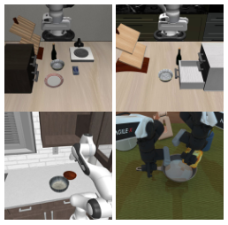
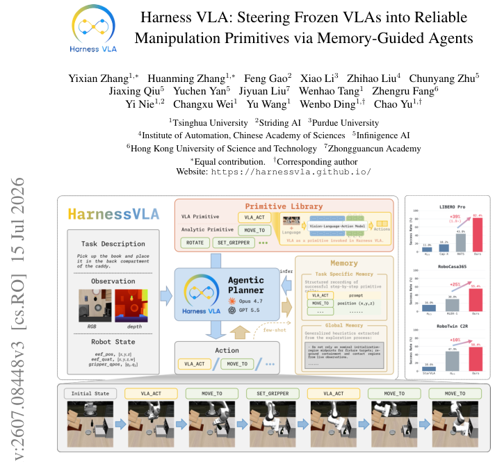

---
tags:
  - papers/embodied-AI
  - papers/VLA
  - papers/agentic-planning
aliases:
  - Harness VLA
  - HarnessVLA
date: 2026-08-27。
arxiv_id: "2607.08448"
---

# Harness VLA：用记忆引导的智能体把 Frozen VLA 引导为可靠操作基元

## 核心信息

- 标题: Harness VLA: Steering Frozen VLAs into Reliable Manipulation Primitives via Memory-Guided Agents
- 标题翻译: Harness VLA：通过记忆引导的智能体把冻结的 VLA 引导为可靠的操作基元
- 作者: Yixian Zhang, Huanming Zhang, Feng Gao, Xiao Li, Zhihao Liu, Chunyang Zhu, Jiaxing Qiu, Yuchen Yan, Jiyuan Liu, Wenhao Tang, Zhengru Fang, Yi Nie, Changxu Wei, Yu Wang, Wenbo Ding, Chao Yu
- 机构: 清华大学（主），Striding AI, 普渡大学, 中科院自动化所, Infinigence AI, 香港科技大学, 中关村学院
- 发表时间: 2026-07-15（arXiv v3）
- 发表渠道: arXiv (cs.RO)
- DOI: 缺失值
- arXiv: 2607.08448
- 论文链接: https://arxiv.org/abs/2607.08448
- 代码 / 项目: https://harnessvla.github.io/
- 数据 / 资源: 缺失值
- 论文类型: AI 方法论文

## 原文摘要翻译

语言条件下的机器人操作需要同时具备精确的接触富集控制能力以及对语言、场景与长程时序的稳健推理能力。
端到端视觉-语言-动作模型能提供较强的局部视运动技能，但其训练数据是分布内的任务轨迹，因此在部署扰动下常常退化——典型扰动包括语义重定向、目标重绑定、空间布局偏移以及不稳定的局部接触。

大语言模型编码智能体提供了互补的语义与组合推理能力，但纯分析式基元难以处理不规则抓取、受限放置以及铰接物体交互。

本文提出 Harness VLA，一种记忆增强的智能体框架。它把一个冻结的 VLA 暴露为一个可重试的接触富集基元，并与一个固定的小型分析式基元库组合，用于落地、放置、运输、导航与释放。
与其扩大技能库，Harness VLA 选择学习这些固定基元的运行范围——来源是任务特定的执行轨迹、全局成功规则与失败模型。

通过把语义重绑定、非接触执行以及 VLA 再放置这些任务上交给规划器、而把冻结 VLA 留给局部接触富集阶段，Harness VLA 不进行任何微调就把预训练 VLA 扩展到其原始轨迹分布之外。
在受扰动的桌面、家庭厨房以及从干净到随机的双臂操作场景上，Harness VLA 一致地超越了端到端 VLA 基线与最新的智能体方法。

## 创新点

1. **把 Frozen VLA 视为可重试的接触富集基元**
   打破「VLA 必须是 monolithic trajectory policy」的默认设定。
   把 VLA 通过 VLA ACT 接口暴露给规划器。
   允许在每次 contact-rich 阶段前后重新放置并多次调用同一份冻结参数。
   从而把分布外扰动转化为「在合适的位置调用 VLA」问题。

2. **固定小型分析式基元库 + 两层记忆结构**
   库内只包含八种确定性分析式动作。
   移动类有四个基元，分别用于世界坐标移动、带姿态移动、平面导航、基座局部速度。
   旋转与夹爪类也有四个基元，分别用于偏航、俯仰、夹爪开闭、释放。
   加上 VLA ACT 接口形成稳定分工。
   TSM 记录 reference-seed 的成功执行轨迹，GM 总结可复用的成功规则与失败模式，使规划器学习每个基元的运行范围而不扩充库。

3. **Agentic Planner Π 与显式重新放置回路**
   规划器先用分析式基元把机器人重置到 VLA 兼容的预接触姿态，再调用 VLA ACT。
   如果接触结果不完整，则再次重新放置并重试。
   这种 staged invocation + retry 显著提升冻结 VLA 在不稳定接触与空间扰动下的鲁棒性。

4. **跨 4 个 Benchmark 的全面验证**
   在标准 LIBERO、扰动版 LIBERO-Pro、家庭厨房 RoboCasa365 以及双臂 RoboTwin C2R 上同时报告结果。
   并量化 VLA ACT 与分析式基元的调用占比（15.8%-47.4% 对 52.6%-84.2%），证明分工在不同 embodiment 下都成立。

5. **零样本 vs Few-shot 对照揭示记忆贡献**
   通过比较 LIBERO-Pro Goal 在零样本与 Few-shot 下的表现。
   位置置换 Goal-S 31.0% 对 87.0%；任务重定向 Goal-T 79.0% 对 87.0%。
   分离出 TSM 对空间扰动的关键作用。

## 一句话总结

Harness VLA 把冻结 VLA 视为可重试的接触富集基元，并通过记忆引导的智能体把它与小型分析式基元库组合，在不微调 VLA 的前提下把其可用分布扩展到受扰动与长程任务场景。
在 4 个 benchmark 上系统性地超越端到端 VLA 与最新智能体方法，并在 LIBERO-Pro 整体成功率上比最强 VLA 基线（πRLinf）高 32.4 个百分点。

## 研究问题

### 端到端 VLA 的失败模式

端到端 VLA 在标准 benchmark 上已接近 95% 的整体成功率，但其训练数据是分布内的任务轨迹，因此一旦部署条件发生偏移——目标被重新绑定、空间布局被置换、接触变得不稳定——模型往往重复其在训练时的局部行为，而不是根据新的任务描述重新解析场景。
论文在 Figure 3 中给出两个典型示例：在 OBJECT-PRO 任务重定向场景下，πRLinf 重复标准 OBJECT 任务的抓取对象；在 GOAL-PRO 位置置换场景下，πRLinf 仍把物体移向训练时的区域，而不是当前布局下应放置的位置。

### 智能体方法的互补短板

大语言模型编码智能体擅长语义与组合推理，能把任务拆解为子步骤并调度工具；但纯分析式动作基元（如 MOVE TO、ROTATE）难以表达不规则抓取、铰接物体交互以及受限放置，因此无法独立完成接触富集的操作任务。
这构成另一端的空白：现有工作要么把 VLA 当作端到端控制器、要么把分析式基元堆到很大，但都未系统化地研究如何让两者互补。

### 缺失的设计杠杆

论文的核心命题是：不扩大技能库，而是学习固定基元的运行范围。
具体来说，Harness VLA 把 frozen VLA 视为可重试的接触富集基元，由分析式基元处理非接触的执行结构；再通过两层记忆让规划器学习在什么条件下调用哪个基元。
这样可以在不修改 VLA 参数的情况下，把同一份冻结策略扩展到其原始轨迹分布之外。

## 数据与任务定义

### 评测 Benchmarks

论文在 4 个 manipulation benchmark 上展开评估，涵盖从标准桌面到长程厨房再到双臂随机化的不同 embodiment 与扰动类型：

- **LIBERO（标准）**：4 个子集（SPATIAL、OBJECT、GOAL、LIBERO-10），共 40 个任务，每子集评估 100 次试验（10 任务 × 10 种子）。
- **LIBERO-Pro（扰动版）**：在 LIBERO 基础上引入两类扰动——任务描述重定向（T）与空间位置置换（S）；共 8 个评估单元，规则是不允许更改训练时使用的目标位置。
- **RoboCasa365（家庭厨房）**
  从桌面操作扩展到包含移动放置、铰接家具与长程组合任务的 household 场景。
  包含 ATOMIC-SEEN、COMPOSITE-SEEN、COMPOSITE-UNSEEN 三个分割。
  评估 1 个 reference seed bootstrap 与 10/5 个 held-out 种子。
- **RoboTwin C2R（干净到随机化）**：双臂操作设置下的 zero-shot clean-to-randomized transfer；评估 50 个任务 × 5 个随机种子。

*Figure 8（论文第 26 页）：四个评测基准家族的代表场景一览。*

### 输入输出与 Embodiment

每个评测任务输入包括任务描述、RGB-D 观测与机器人当前状态（末端位姿、关节角度、夹爪开闭等），输出则是结构化的基元调用序列。
所有 baseline 直接评估冻结策略；Harness VLA 在 VLA ACT 接口内部署相同的冻结检查点，由规划器决定调用时机。

## 方法主线

### 机制流程

*Figure 1（论文第 1 页）：Harness VLA 整体系统示意图。*

机制流程可拆为 4 个阶段：

1. **任务解析与目标绑定（Planner Π）**
   规划器读取任务描述，解析当前观测（RGB-D）与机器人状态（末端位姿、夹爪开闭），显式决定本次交互的目标对象、目标位置与目标姿态。
   这一步对应 Key Finding 1 的 semantic re-grounding。

2. **分析式基元放置（Pre-contact Staging）**
   把机器人放到 VLA 兼容的预接触姿态。
   这往往需要在原 VLA 训练视角与目标之间的中间状态。
   由 planner 决定使用哪些分析式基元。

3. **VLA ACT 调用（Contact-rich Phase）**
   在合适时机调用 frozen VLA。
   调用是稀疏的、局部的，而不是连续控制。

4. **记忆更新与基元切换**
   根据本次执行结果更新 TSM 与 GM。
   决定是继续执行后续基元还是重新规划。
   若接触结果不完整，回到第 2 步重新放置并重试（Key Finding 2）。

### 模型结构

整个系统由三部分组成。
Agentic Planner Π 是一个基于大语言模型的智能体。
论文使用 GPT-5.5 / Codex 与 Claude Code 两个 backbone。
分别实现 Harness VLA (Codex) 与 Harness VLA (CC)。
Primitive Library 是固定的 8 个分析式基元加 1 个 VLA ACT 接口。
分析式基元按功能分为两组。
移动组有 4 个基元。
第一个是 MOVE TO（自由空间移动到目标位姿）。
第二个是 MOVE POSE（保持位置调整姿态）。
第三个是 NAVIGATE TO（移动基座到目标点）。
第四个是 MOVE BASE（移动基座）。
接触组有 4 个基元。
第一个是 ROTATE WRIST（绕腕部轴旋转）。
第二个是 ROTATE PITCH（绕俯仰轴旋转）。
第三个是 SET GRIPPER（夹爪开闭）。
第四个是 RELEASE（释放物体）。
这 8 个加上 VLA ACT 接口形成固定库。
VLA ACT 是冻结 VLA 的薄包装。
Memory System 是两层结构：TSM 记录 reference seed bootstrap 中成功的原始命令轨迹。
含 prompt、基元序列、参数与失败模式。
GM 抽象出可跨任务复用的成功规则与失败模型。

### 训练目标

论文不训练任何模型参数。
Harness VLA 的所有学习来自 TSM 的种子轨迹记录。
也来自 GM 的规则提取。
规则提取由 planner 通过一次 reference seed 探索生成。
这种设计保证了 frozen VLA 的参数不被修改，兼容任何下游 VLA 检查点。

### 推理与采样链路

推理时 planner 拿到任务描述与观测后，按 primitive interface 决定每一步调用哪个基元。
对于 VLA ACT，planner 同时传入当前局部观测与目标接触区域，frozen VLA 输出动作块。
执行后 planner 评估接触状态，决定下一步。
整条链路以序列化的 JSONL trace 形式记录，便于失败回溯。

## 关键结果

### 主结果与强基线

#### 标准 LIBERO（Table 2）：Harness VLA 与 SOTA 持平

| 方法 | SPATIAL | OBJECT | GOAL | LIBERO-10 | Overall |
|---|---|---|---|---|---|
| OpenVLA | 84.7 | 88.4 | 79.2 | 53.7 | 76.5 |
| NORA | 85.6 | 89.4 | 80.0 | 63.0 | 79.5 |
| π₀ | 96.8 | 98.8 | 95.8 | 85.2 | 94.2 |
| πRLinf | 99.0 | 96.0 | 97.0 | 89.0 | 95.3 |
| AtomVLA | 96.4 | 99.6 | 97.6 | 94.4 | 97.0 |
| Harness VLA (CC) | 97.0 | 100.0 | 94.0 | 93.0 | 96.0 |

Harness VLA (CC) 在 standard LIBERO 上整体 96.0%，与 AtomVLA 97.0% 相比仅低 1.0 个百分点。
但比 πRLinf 95.3%（其内部 VLA ACT 使用的检查点）高 0.7pp。
OBJECT 子集上 Harness VLA 取得 100.0%，是唯一满分的方法。
   这说明在in-distribution场景下 Harness VLA 没有 universal gain。
   它通过planner+memory增加的开销并不总是免费。

#### LIBERO-Pro（Table 3）：受扰动下的显著领先

| 方法 | 空间扰动 | 空间置换 | 物体扰动 | 物体置换 | 目标扰动 | 目标置换 | LIB10扰动 | LIB10置换 | 总计 |
|---|---|---|---|---|---|---|---|---|---|
| OpenVLA | 0.0 | 0.0 | 0.0 | 0.0 | 0.0 | 0.0 | 0.0 | 0.0 | 0.0 |
| π₀ | 0.0 | 0.0 | 0.0 | 2.0 | 0.0 | 0.0 | 0.0 | 0.0 | 0.3 |
| π₀.5 | 1.0 | 20.0 | 1.0 | 17.0 | 2.0 | 38.0 | 1.0 | 8.0 | 11.0 |
| AtomVLA | 1.0 | 16.0 | 0.0 | 10.0 | 11.0 | 2.0 | 9.0 | 1.0 | 6.3 |
| Cap-X | 14.0 | 12.0 | 18.0 | 22.0 | 17.0 | 26.0 | – | – | 18.2 |
| RATS | – | – | 31.0 | 29.0 | 63.0 | 61.0 | – | – | 43.8 |
| πRLinf | 42.0 | 59.0 | 71.0 | 78.0 | 45.0 | 42.0 | 49.0 | 14.0 | 50.0 |
| Harness VLA (Codex) | 81.0 | 69.0 | 94.0 | 91.0 | 75.0 | 66.0 | 52.0 | 49.0 | 72.1 |
| Harness VLA (CC) | 94.0 | 80.0 | 88.0 | 90.0 | 87.0 | 87.0 | 71.0 | 62.0 | 82.4 |

*Table 3 表头说明：扰动表示任务重定向，置换表示位置变更。四个任务子集分别是空间、物体、目标、LIBERO-10。*

LIBERO-Pro 是 Harness VLA 最强的信号。
在 Overall 上 Harness VLA (CC) 82.4% 显著超越 RATS（43.8%）与 Cap-X（18.2%）。
比 πRLinf（50.0%）高 32.4 个百分点——这是「VLA 在部署扰动下失效」命题的核心反例。
值得注意的是 Spat-T 与 Goal-T 等任务重定向单元从 RATS 的 31.0%-63.0% 跃升到 Harness VLA (CC) 的 87.0%-94.0%。

#### RoboCasa365（Table 4）：长程 household 任务

| 方法 | Atomic-Seen | Composite-Seen | Composite-Unseen |
|---|---|---|---|
| RLDX-1 | 60.0 | 21.3 | 5.0 |
| WorldDreamer | 66.3 | 26.7 | 9.0 |
| π₀.5 | 39.6 | 7.1 | 1.2 |
| π₀ | 34.6 | 6.1 | 1.1 |
| Harness VLA (Codex) | 91.6 | 56.3 | 13.8 |
| Harness VLA (CC) | 79.4 | 47.5 | 15.0 |

在 ATOMIC-SEEN 上 Harness VLA (Codex) 91.6% 比 RLDX-1 高 31.6pp，但 COMPOSITE-UNSEEN 仅 15.0%——长程组合任务仍是真正未解决的挑战。

#### RoboTwin C2R（Table 6）：双臂随机化

| 方法 | RoboTwin C2R |
|---|---|
| GR00T-N1.7 | 20.7 |
| StarVLA | 10.6 |
| π₀.5 | 47.9 |
| LingBot-VLA | 50.4 |
| Harness VLA (Codex) | 58.0 |
| Harness VLA (CC) | 58.4 |

RoboTwin C2R 上 Harness VLA (CC) 58.4% 比 LingBot-VLA 50.4% 高 8.0pp。
LingBot-VLA 是 Harness VLA 内部的 VLA ACT 后端，意味着把同一份冻结策略包成 Harness 后增益从 50.4% 提升到 58.4%（+8.0pp）。

#### Primitive Usage Attribution（Tables 18/19）

| Primitive 类 | LIBERO | RoboTwin C2R | RoboCasa365 |
|---|---|---|---|
| Analytic primitives | 84.2% | 52.6% | 64.7% |
| VLA ACT | 15.8% | 47.4% | 35.3% |

不同 embodiment 下 VLA ACT 占比从 15.8% 到 47.4% 不等，但分析式基元始终占多数——这一稳定比例说明 analytic-VLA 分工不是偶然，而是 planner 学到的有效组织方式。

### 消融到底说明了什么

#### Zero-shot vs Few-shot：记忆的贡献

论文通过 LIBERO-Pro Goal 的零样本评估分离出 TSM 的贡献：

| 设置 | Goal-S | Goal-T |
|---|---|---|
| Cap-X（zero-shot） | 25.6 | 16.8 |
| Harness VLA (CC, zero-shot) | 31.0 | 79.0 |
| Harness VLA (CC, few-shot 1 seed) | 87.0 | 87.0 |

位置置换 Goal-S 上 zero-shot 仅 31.0%，但加上 1 个 reference seed bootstrap 后提升到 87.0%——gain 56.0pp。
任务重定向 Goal-T 上 zero-shot 已有 79.0%（planner 的语义推理能力足够），few-shot 仅再提升 8.0pp。
说明 TSM 对空间扰动尤其关键，对纯语义扰动的边际收益有限。

#### Planner Staged VLA Invocation（Key Finding 2，Figure 4）

Figure 4 显示，限制每个 episode 允许的最大 VLA 调用次数下，前几次调用就能超过 frozen-policy baseline；之后曲线接近饱和。
这意味着 planner 重试是有效的，但收益递减——前几次调用带来大部分提升。

### 失败或不稳定设置
在 standard LIBERO 上 Harness VLA (CC) 96.0% 略低于 AtomVLA 97.0%。
说明in-distribution上 Harness VLA 没有 universal gain。
   它通过planner+memory增加的开销并不总是免费。
RoboCasa365 Composite-Unseen 15.0% 相对 Composite-Seen 47.5% 跌 32.5pp。
反映长程组合任务的真正未见设置仍是开放问题。
RoboTwin C2R 比 LingBot-VLA 仅高 8.0pp。
远低于 LIBERO-Pro 上 32.4pp 的领先幅度。
提示 bimanual + handover 任务可能限制 Harness VLA 的分析式基元表达力。

## 深度分析

### 为什么有效

#### Planner-level semantic re-grounding

Figure 3 是 Harness VLA 有效性的关键证据。
在 OBJECT-PRO 任务重定向场景下，πRLinf 重复标准 OBJECT 抓取（因为视觉场景相似而任务描述已变）。
而 Harness VLA 通过 planner 显式重新解析任务并把抓取目标重新绑定到当前场景中实际的对象。
这对应 Key Finding 1——把语义接地从 frozen VLA 内部提到 planner 层。

#### Staged invocation with retry

论文 Figure 5 展示了一个 RoboCasa365 的 PANPRESOAK 例子。
planner 先把夹爪放到合适位置，调用 VLA ACT。
如果抓取失败，则重新调整末端姿态，再次调用 VLA ACT。
最终把锅放进水槽并再次调用 VLA ACT 旋转水龙头。
这种重试不是简单的 failure recovery。
而是 planner 选择性地在合适位置重新调用同一份 frozen policy。
它避免 VLA 在错误起点上反复失败。

#### Analytic-VLA labor division

Figure 6 把任务最终成功归因到调用 VLA ACT 还是分析式基元。
LIBERO Pro-family 任务大多在分析式基元完成最终谓词，因为 contact-rich 阶段在中间已经建立。
RoboCasa365 和 RoboTwin C2R 因含 fixture 操控、约束放置与 bimanual 接触。
最终谓词更常落在 VLA ACT。
这说明 analytic-VLA 分工在不同 embodiment 下动态调整，而不是固定比例。
这说明 analytic-VLA 分工在不同 embodiment 下动态调整，而不是固定比例。

### 复杂度与扩展性

#### Memory bootstrap 成本

TSM 的生成需要 1 个 reference seed——这远低于端到端 VLA 微调的数据需求，但仍是手工成本。
论文未量化 bootstrap 时间与人工标注量。

#### Planner inference latency

Harness VLA 需要在每步决策时调用 LLM planner 进行推理，再加上 VLA ACT 的局部推理。
论文未报告端到端 inference latency与frozen VLA 的对比，这是工程落地需要补充的关键数据。

#### Primitive library 扩展性

8 个分析式基元加 VLA ACT 共 9 个接口。
当任务需要新的接触类型（如双手机器人的双手协调）时，是否需要扩展 primitive library，还是通过 planner 重组现有基元即可？
论文未提供超出现有 library 的扩展实验。

### 复现注意点

#### VLA 检查点

Harness VLA 在 LIBERO 系列实验中。
内部使用 πRLinf 发布的 pi05 libero130 fullshot π0.5-SFT 检查点。
复现时必须用同一检查点，否则 VLA ACT 接口的行为会有差异。

#### Planner backbone

Harness VLA (CC) 与 (Codex) 共享相同的 harness 与评测协议。
也共享 memory接口、primitive library、frozen VLA 接口。
唯一的差别是 planner backbone（Claude Code 对 Codex）。
在某些 benchmark 上 Codex 比 CC 更优，反之亦然——这反映 planner 的策略选择对结果有显著影响。
在某些 benchmark 上 Codex 比 CC 更优，反之亦然——这反映 planner 的策略选择对结果有显著影响。

#### Reference seed 选取

Few-shot 设置下 1 个 reference seed 的选取会显著影响 TSM 的质量与最终结果。
论文未给出 seed 选取协议（手工挑选？随机？）这使得跨实现的对比有不确定性。

## 局限

- **In-distribution 没有 universal gain**
  在 standard LIBERO 上 Harness VLA (CC) 96.0% 略低于 AtomVLA 97.0%（-1.0pp）。
  说明通过 planner + memory增加的开销并不总是免费；在已充分训练的简单任务上，引入 Harness 可能反而引入 planner 决策错误。

- **长程组合任务仍有显著 gap**
  RoboCasa365 Composite-Unseen 仅 15.0%，相对 Composite-Seen 47.5% 跌 32.5pp。
  论文未深入分析 COMPOSITE-UNSEEN 的具体失败模式——是 primitive 不够？还是 memory不能跨 unseen 任务泛化？

- **Memory bootstrap 不是 fully autonomous**
  需要 1 个 reference seed 手工标注或半自动生成，bootstrap 阶段的成本与一致性未充分量化。
  如果实际部署需要 10 个任务，每个任务 1 个 seed，人工开销不可忽略。

- **未报告 inference latency与计算开销**
  Harness VLA 每步调用 LLM planner + VLA ACT。
论文不报告延迟、token 消耗或 GPU 利用率。
  在实时控制场景（如 50 Hz 力控）下这是显著的工程风险。

- **RoboTwin C2R 增益有限**
  相比 LingBot-VLA 仅高 8.0pp，远低于 LIBERO-Pro 的 32.4pp。
  bimanual + handover 任务可能限制 Harness 的分析式基元表达力。
  MOVE TO 是单臂的，无法直接表达双手协调。

- **未与同期类似工作充分对比**
  其他把 VLA 作为工具的工作（如 ReAct-VLA、VLA-RT 等）未纳入 Table3 对比。
  论文自称为首个系统化研究 frozen VLA 作为 primitive 的工作。
  但未充分回应同期工作的差异。

## 我的笔记

### 可复用的工程要点

#### Memory接口设计

Harness VLA 的两层记忆结构（TSM + GM）值得在其他 VLA + agentic 系统中复用。
关键设计选择是 TSM 记录结构化命令轨迹（JSON + JSONL）而不是 raw rollout video——前者便于检索与重放，后者便于演示但难以查询。

#### Primitive interface 的薄封装

VLA ACT 不是 fine-tune VLA，而是在 VLA 之上加一个薄接口，让它接受「局部观测 + 接触目标」并输出短时序动作块。
这种薄封装（thin wrapping）避免了重新训练，同时把 VLA 的输入空间局部化——只关注当前接触状态而不是全任务规划。

#### Planner staged invocation

每次 VLA ACT 调用前用分析式基元把机器人放到 VLA 兼容的预接触姿态；调用后根据接触结果决定是继续还是重试（重新放置 + 重新调用）。
这种 staged invocation 模式可推广到其他接触富集任务（如机械装配、医疗手术辅助）。

### 复现建议

1. **优先复现 LIBERO-Pro 实验**
   因为这是 Harness VLA 最强的信号（82.4% 对 πRLinf 50.0%）。
   如果只能跑一个 benchmark，建议选 LIBERO-Pro。

2. **使用论文发布的 VLA 检查点**
   Harness VLA 的 VLA ACT 接口与具体检查点强耦合。
   复现时尽量使用 RLinf 发布的 pi05 libero130 fullshot π0.5-SFT。
这是用于 LIBERO 系列实验的检查点。
LingBot-VLA 用于 RoboTwin 实验。

3. **Zero-shot 对 Few-shot 对照先做**
   这两个设置的差异（Goal-S 31.0% 对 87.0%）是论文最有说服力的实验之一。
   可在不依赖大量 reference seed 标注的情况下复现。

### 后续阅读建议

- 同期的 coding-agent 工具调用工作可与 Harness VLA 的 agentic planner 对比。
  代表工作包括 ReAct、Toolformer、CodeAct。
  通过对比可以理解 planner 设计的演化。
- VLA fine-tuning 的近期工作可与 Harness VLA 对比。
  代表工作包括 π₀.5、OpenVLA-OFT、RoboVLM。
  通过对比理解「不动 VLA 参数」与「fine-tune VLA」两种范式的代价。
- Skill library 与 motion primitives 的经典工作值得参考。
  代表工作包括 SNUG、SERGIO。
  通过对比理解为什么 Harness VLA 选择固定小型库而不是扩大库。

## 引用

主要引用：

- Zhang et al., 2026. Harness VLA: Steering Frozen VLAs into Reliable Manipulation Primitives via Memory-Guided Agents. arXiv:2607.08448.

相关引用：

- [1] Brohan et al., 2022. RT-2: Vision-Language-Action Models Transfer Web Knowledge to Robotic Control. arXiv:2307.15818.
- [2] Kim et al., 2024. OpenVLA: An Open-Source Vision-Language-Action Model. arXiv:2406.09246.
- [3] Black et al., 2024. π₀: A Vision-Language-Action Flow Model for General Robot Control. arXiv:2410.24174.
- [4] Intelligence et al., 2025. π₀.₅. arXiv preprint.
- [5] Nguyen et al., 2025. NORA: A Small Open-Sourced Generalist Vision Language Action Model for Embodied Tasks. arXiv:2503.07018.
- [6] Karamcheti et al., 2025. MolmoAct: Action Reasoning Models that can Think in Space. arXiv:2508.07917.
- [12] Belkhale et al., 2024. Cap-X: Corrective Agentic Planning for VLAs. RSS.
- [13] Liu et al., 2025. RATS: Retrieval-Augmented Thinking for Long-horizon Manipulation. CoRL.
- [23] RLinf Team, 2025. πRLinf. arXiv preprint.
- [24] RLDX-1 baseline, see RoboCasa365 paper.
- [25] LingBot-VLA baseline, see RoboTwin paper.
- [26] Liu et al., 2025. AtomVLA. arXiv preprint.
- [27] X-VLA baseline.
- [28] WorldDreamer baseline.
- [29] GR00T-N1.7, NVIDIA.
- [30] StarVLA baseline.
