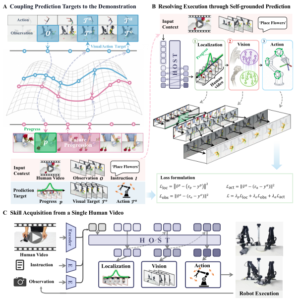
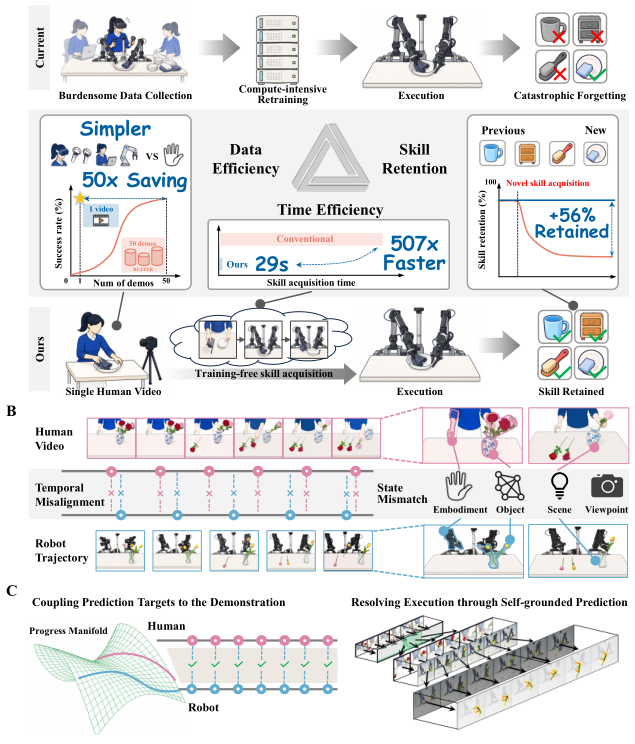
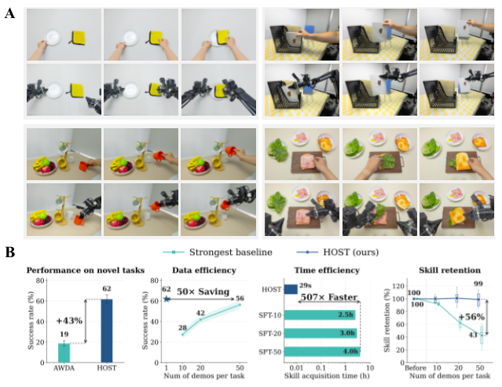
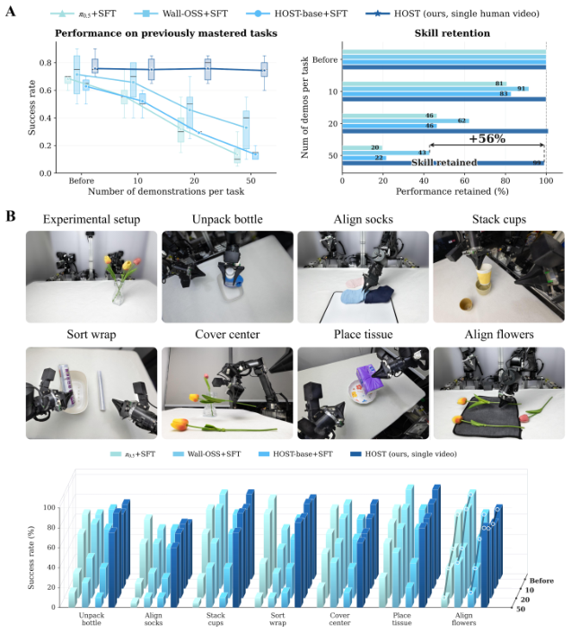
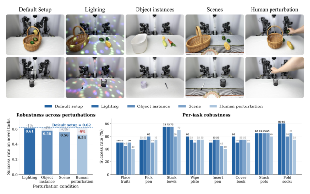
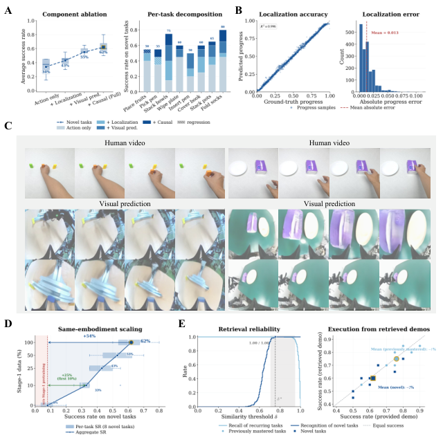

# HOST: Robots Acquire Manipulation Skills in Seconds from a Single Human Video

## 核心信息

- 标题: HOST: Robots Acquire Manipulation Skills in Seconds from a Single Human Video
- 标题翻译: HOST: 机器人从单条人类视频中以秒级速度习得操作技能
- 作者: Chen Guangyan, Wang Meiling, Cui Te, Zhou Zichen, Shao Qi, Li Shalfun, Su Hang, Gan Roy, Wang Hao, Fu Mengyin, Yang Yi, Yue Yufeng
- 机构: 北京理工大学 + X SQUARE ROBOT(自变量智能)+ 清华大学(联合项目)
- 发表时间: 2026-07-22 (arXiv v1, 现有 v4)
- 发表渠道: arXiv 预印本
- arXiv: 2607.20033
- 论文链接: https://arxiv.org/abs/2607.20033
- 代码 / 项目: https://github.com/CGuangyan-BIT/HOST
- 数据 / 资源: Stage-1 跨本体人类视频大规模预训练 + 7 个真实机器人桌面任务
- 论文类型: AI 方法论文(从观察中模仿 + 级联自预测 + 持续学习)

## 原文摘要翻译

机器人在快速且无负担地习得技能的同时保留已掌握的能力,这一特性至关重要。然而当前方法仍依赖一个既笨重又缓慢的训练时循环,且会侵蚀已习得的技能。本文提出 HOST(Human-to-robot One-Shot Skill AcquisiTion),一个让机器人从单条人类视频中以秒级速度习得技能、同时保留已掌握能力的框架。HOST 通过级联式自接地预测解决技能获取问题:首先估计机器人在演示任务中的进度,然后把即将到来的进度翻译成机器人自身的未来观测,最后从这些预测的观测中推导出动作。该级联在耦合到视频演示的训练目标上学习,这些目标通过把机器人轨迹与视频演示映射到共享的"任务进度流形"上,然后重新定义每个目标以对齐视频的未来进度而获得。HOST 因此能让机器人主动跟随演示流程,并适配机器人本体。HOST 在推理时从单条人类视频以平均 29 秒的速度获取新技能,达到 62% 平均成功率,相对零样本基线提升 45%,同时保留已掌握技能。HOST 甚至超过用每任务 50 条机器人演示微调的基线,而所需演示少 50 倍、获取速度快 507 倍。

## 创新点

- **🎯 级联式自接地预测 (Cascade Self-grounded Prediction)** — 把"进度估计 → 未来观测预测 → 动作推导"串成三阶段级联,让模型不依赖人类视频与机器人视频之间的显式对齐,而是用视频帧内部特征自监督,大幅简化跨本体迁移流程。
- **🔗 共享进度流形耦合 (Coupling via Progress Manifold)** — 创新地把机器人轨迹与人类视频投影到同一共享的"任务进度流形"上,再以视频未来进度重新定义每个训练目标,实现动作跟随与观测跟随的端到端协同。
- **⚡ 单视频免训练技能获取** — 推理时只需 1 条 ~29 秒人类演示视频,无需任何机器人演示或微调;**507× 加速** + **50× 数据节省** vs SFT-50 基线。
- **🛡 反灾难性遗忘检索模块** — 通过检索式技能保留机制,在不断学习新技能的同时保留旧技能(50 demos 后 99% 保留率 vs 基线 20-43%)。

## 一句话总结

> HOST 通过"级联式自接地预测"(Localization → Vision → Action) + 共享进度流形 + 检索式技能保留,让机器人从单条 29 秒人类视频中以 62% 成功率习得全新操作任务,比 50 demos 微调基线快 507×、省 50× 数据,且保留 99% 旧技能。

## 研究问题

当前机器人技能获取方法存在四个核心痛点:

- **🎯 数据依赖**: 主流 SFT / RL 方法需每任务数十条到数百条机器人演示,数据采集成本高。
- **⏱ 训练循环慢**: 每次新技能都要 compute-intensive 重训练,fast iteration 难实现。
- **😵 灾难性遗忘**: 持续学习场景下,学新任务会侵蚀旧任务性能(论文 Fig 7 展示基线从 100% 跌至 20%)。
- **🔄 跨本体鸿沟**: 人类视频与机器人视频存在 embodiment / object / scene / viewpoint 四重错配(Fig 1B),直接做 video-video matching 难以泛化。

HOST 的关键主张:**用"任务进度"作为人-机器人共享表征**——进度本身就是跨本体不变的语义量,只需把它对齐到共享流形,就能避开上述四重错配。进而通过级联自接地预测(从单视频 + 当前观测预测未来),完全免去机器人演示采集。

## 数据与任务定义

- **🎥 Stage-1 预训练数据**: 大规模跨本体人类视频(具体规模未在 main paper 列出,Table 4 在 appendix),用于学习通用视觉-动作-进度耦合。
- **🤖 真实机器人硬件**: 双臂机器人(7 个桌面任务):
  - Unpack bottle(拆瓶)
  - Align socks(对齐袜子)
  - Stack cups(叠杯)
  - Sort wrap(分类包装纸)
  - Cover center(盖中心花)
  - Place tissue(放纸巾)
  - Align flowers(对齐花朵)
- **📊 评估任务**: 8 个新颖任务(Place fruits / Pick pen / Stack bowls / Wipe plate / Insert pen / Cover book / Stack pots / Fold socks)用于测 novel 性能。
- **📈 评估指标**:
  - Novel task success rate(7-8 任务平均)
  - Skill retention %(累积学习 10/20/50 demos 后的旧任务保留率)
  - Skill acquisition time(秒)
  - Perturbation robustness(Lighting / Object / Scene / Human 四类扰动)
- **🔬 基线对比**: π0.5 + SFT、Wall-OSS + SFT、HOST-base + SFT、AWDA 等。

## 方法主线

### 机制流程(三步)

1. **📊 共享进度流形构建 (Coupling via Progress Manifold)** — 把机器人轨迹与人类视频投影到共享的任务进度流形 $\mathcal{M}_\text{progress}$ 上,通过最小化 SDTW (Soft Dynamic Time Warping) + TCC (Temporal Cycle Consistency) 损失对齐两者的时间轴。
2. **🎯 级联式自接地预测 (Cascade Self-grounded Prediction)** — 给定历史观测 token,串行执行三个预测头:① **Localization**:预测当前任务进度 $p$ (R²=0.996,MAE=0.013);② **Vision**:基于进度 $p$ 预测未来视觉目标 $\mathcal{T}^o$;③ **Action**:基于视觉目标预测动作 $\mathcal{T}^a$。
3. **🛡 检索式技能保留 (Retrieval-based Skill Retention)** — 执行时通过相似度阈值 $\delta^*=0.68$ 检索已掌握技能演示,新技能学习不覆盖旧技能(99% retention @ 50 demos)。

### 三大组件细节

#### Cascade Self-grounded Prediction(三阶段级联)

- **📊 Localization 头** — 输入历史观测 token,输出当前任务完成进度 $p$ ∈ [0, 1];形式化为 $\mathcal{L}_\text{loc} = \|\hat{v}^p - (\varepsilon_p - y^p)\|^2$。R²=0.996 表明预测近乎完美。
- **🎨 Vision 头** — 输入当前进度 + 历史观测,自回归生成未来观测的视觉目标 $\mathcal{T}^o$;形式化为 $\mathcal{L}_\text{obs} = \|\hat{v}^o - (\varepsilon_o - y^o)\|^2$。论文 Fig 10C 展示从单帧人像自回归生成完整执行视频。
- **⚙ Action 头** — 输入当前观测 + 视觉目标,生成动作 chunk $\mathcal{T}^a$;形式化为 $\mathcal{L}_\text{act} = \|\hat{v}^a - (\varepsilon_a - y^a)\|^2$。
- **总损失**: $\mathcal{L} = \lambda_p \mathcal{L}_\text{loc} + \lambda_o \mathcal{L}_\text{obs} + \lambda_a \mathcal{L}_\text{act}$。

#### Coupling via Progress Manifold

- **🔗 共享流形构建**: 用 SDTW softmin + TCC variance 同时优化机器人轨迹与人类视频到同一流形的映射,使两者时间轴对齐但不强求帧级对应。
- **🎯 重新定义训练目标**: 把目标 $\mathcal{T}^o, \mathcal{T}^a$ 重新定义为"对齐视频未来进度的视觉/动作表征",而非"对齐视频具体帧"。这一改动让训练目标与推理目标一致。
- **⚙ 架构细节**: Vision encoder = Qwen3-VL-Embedding-8B (fine-tuned, bf16);hidden dim 1536 / embedding dim 128;12K 训练步,64 GPUs,每 GPU 4 batch。

#### Retrieval-based Skill Retention

- **🔍 检索逻辑**: 在执行新任务时,从已掌握技能库中检索相似演示($\delta > \delta^*=0.68$);检索成功 → 复用历史轨迹 + 当前观测;检索失败 → 走级联预测生成新动作。
- **📈 实证**: 检索模块在 δ*=0.68 处对已掌握任务达到 100%/100% 完美检索;对新任务保持低误触;检索-执行的性能损耗仅 -1% 已掌握 / -2% 新颖。
- **🛡 反遗忘**: 通过复用历史轨迹而非重训,避免参数漂移导致的灾难性遗忘。

*图 2(论文 page 4): HOST 整体框架 overview——面板 A 展示 Coupling Prediction Targets to the Demonstration(共享进度流形),面板 B 展示 Resolving Execution through Self-grounded Prediction(三阶段级联 + 损失函数),面板 C 展示 Skill Acquisition from a Single Human Video 的完整管线(单视频 + 指令 + 当前观测 → Localization → Vision → Action → 真实机器人执行)。*

*图 1(论文 page 2): HOST teaser——A 面板宏观对比 Current vs Simpler(50× 数据 / 29 秒 / 507× 快 / +56% 保留);B 面板 Single Human Video → Training-free Skill Acquisition + 四类人-机器人错配(Embodiment / Object / Scene / Viewpoint);C 面板 Coupling & Self-grounded Prediction 技术原理。*

## 关键结果

### Fig 3 定量对比(4 维度)

HOST 在 4 个核心维度上 vs 最强基线 AWDA(zero-shot):

| 维度 | HOST | AWDA (baseline) | 优势 |
|---|---|---|---|
| Novel task success | **62%** | 19% | **+43pp** |
| Data efficiency | **1 video** = 62% | 50 demos = 56% | **50× 数据节省** |
| Time efficiency | **29s** | 2.5-4.0 hours (SFT) | **507× 加速** |
| Skill retention | **99%** (50 demos 后) | 43% | **+56pp** |

### Fig 7 技能保留(7 真实任务)

50 demos 后旧任务保留率:

| 方法 | 保留率 |
|---|---|
| π0.5 + SFT | 20% |
| Wall-OSS + SFT | **43%** |
| HOST-base + SFT | 22% |
| **HOST (ours)** | **99%** |

7 个真实任务上(Align socks / Place tissue / Align flowers 等难任务)HOST 几乎全胜,基线随 demo 数增加逐步崩塌。

### Fig 8 鲁棒性扰动

5 种条件下(默认 / Lighting / Object 实例 / Scene / Human perturbation)对 8 个新颖任务测得成功率:

| 条件 | 成功率 | 相对下降 |
|---|---|---|
| Default Setup | 0.62 | – |
| Lighting | 0.61 | -1% |
| Object instance | 0.58 | -4% |
| Scene | 0.56 | -6% |
| Human perturbation | 0.53 | **-9%** |

### Fig 10 组件消融(级联逐步累加)

Ablation 链条(Fig 10A):

| 配置 | 成功率 |
|---|---|
| Action only | 34% |
| + Localization | 43% |
| + Visual prediction | 55% |
| + Causal (Full) | **62%** |

每一步 +8-12pp,级联效应显著。Fig 10B 显示定位模块近乎完美(R²=0.996)。Fig 10C 展示视觉预测生成质量。Fig 10D 显示 Stage-1 预训练数据缩放(8% → 62% 对数线性)。Fig 10E 验证检索模块在 δ*=0.68 处达到 100%/100% 检索准确率。

### 单任务成功率(Fig 10A 右)

| 任务 | 成功率 |
|---|---|
| Place fruits | 50% |
| Pick pen | 55% |
| Stack bowls | **75%** |
| Wipe plate | 60% |
| Insert pen | **50%**(最难) |
| Cover book | 60% |
| Stack pots | 65% |
| Fold socks | **80%** |

*图 3(论文 page 6): A 面板 — 4 个真实任务定性结果(整理餐具 / 整理文件 / 厨房整理 / 三明治制作);B 面板 — 4 维度定量对比柱状图(Novel 62% / Data 50× / Time 507× / Retention 99%)。*

*图 7(论文 page 11): A 面板 — 技能保留曲线(基线崩塌 vs HOST 稳定 0.75) + 保留率条形图(HOST 99% vs 基线 20-43%);B 面板 — 7 真实任务 3D 柱状图(HOST 全胜)。*

*图 8(论文 page 12): 上半部 — 5 种扰动条件下的真实机器人场景(Lighting / Object / Scene / Human perturbation);下半部 — 整体 + 8 任务级鲁棒性柱状图(最大下降 -9%)。*

*图 10(论文 page 15): 5 面板消融 + 可解释性分析——A 级联 ablation(34 → 43 → 55 → 62%) + 7 任务逐项分解;B 定位模块精度(R²=0.996, MAE=0.013);C 视觉预测定性;D Stage-1 数据缩放(8% → 62%);E 检索可靠性(δ*=0.68 达到 100%/100%)。*

## 深度分析

### 为什么 "Cascade Self-grounded" 比 "Video-video Matching" 更好

- **🌐 跨本体不变量是"任务进度"而非"具体动作"** — 不同 embodiment 做同一任务的轨迹完全不同(人手 vs 双臂),但完成度(进度)是同一标量。Progress manifold 是跨本体鲁棒的共享表征。
- **🔗 共享流形 + 自接地 = 端到端可训** — 旧方法(Open-X-Embodiment 等)用 contrastive / cycle-consistency 在视频空间对齐,训练目标与推理目标脱节;HOST 把训练目标重新定义为"对齐视频未来进度",训练-推理一致。
- **⚡ 推理时完全免训练** — 旧方法需新任务时要么 fine-tune(慢)、要么检索拼接(碎片化);HOST 训练好之后无需任何更新,直接对单条视频推理。

### 与 WALL-SS 的定位差异

- **🛰️ WALL-SS(同一团队的早期工作)**: 长时程 + 动作可控世界模型,目标是"用世界模型做规划与评估",落点在 world model loop。
- **🎯 HOST**: 低层级单次技能获取 + 持续学习,目标是"29 秒学一项新技能且不丢旧技能",落点在 skill acquisition loop。
- **🔗 潜在组合**: HOST 提供单任务快速获取,WALL-SS 提供长时程世界模型 — 未来可能看到 "HOST 单技能获取 → WALL-SS 世界模型 rollout → 闭环评估"的级联管线。

### 实证级联效应(Fig 10A ablation 解读)

- **🎯 Action only 34%** — 基线:只能从当前观测映射到动作,无任何未来预测,本质是 behavior cloning,鲁棒性差。
- **📊 +Localization +9pp → 43%** — 知道当前进度后,动作选择有了"我在任务哪一步"的语境。
- **🎨 +Visual prediction +12pp → 55%** — 把"未来该看到什么"显式建模,给动作提供了视觉锚点。
- **⚙ +Causal (Full) +7pp → 62%** — 加入因果推理,把预测的视觉目标与动作的因果关系显式建模。
- **🔍 启示**: 每一步都有 7-12pp 提升,说明"显式建模未来 + 进度 + 因果"三者协同,缺一不可。

### 与现有 VLA / LeRobot 生态的对接

- **🤖 LeRobot 当前聚焦 FSDP2 + DTensor 训练 + ZMQ 相机 + Isaac Teleop**: HOST 的"单视频 29 秒学习"能力与 LeRobot 套件互补 — 当 LeRobot 框架遇到"新任务想快速部署但没有机器人演示数据"时,HOST 可作为 skill acquisition 前端。
- **🧠 与 pi0.5 / DreamZero 的关系**: HOST 不替代这些 SFT-based VLA,而是在它们基础上加 "one-shot 从人类视频迁移"的能力。
- **📊 局限**: HOST 评估只在桌面任务(7 个),未涉及移动 / 双臂非结构化 / 人形等场景 — LeRobot 套件需要补这一块的覆盖。

## 局限

- **🎯 62% 成功率的天花板** — 单视频 → 技能获取虽然免训练,但平均 62% 距全自主仍有差距;Insert pen 类精细对齐任务降至 50%。
- **⏱ 进度流形的容量** — 模型能存多少独立技能?论文未给出 upper bound 评估。
- **🤖 跨本体未验证** — 论文实验集中在桌面 + 双臂,未涉及 humanoid / 移动机器人 / 复杂 multi-stage loco-manipulation。
- **🛡 Human perturbation -9%** — 当人类主动干预环境时,性能下降最大;动态环境的鲁棒性不足。
- **📦 Stage-1 预训练数据依赖** — 0% 预训练 → 62% 全量,说明方法对预训练规模敏感;小团队难以复现。
- **⏱ 推理时 29 秒仍是"批处理式"** — 实时连续学习的闭环应用可能受推理延迟约束。

## 我的笔记

### 与 VLA / LeRobot 生态对接(2026-08-28 复盘)

- **🎯 HOST 与 WALL-SS 同团队 — X SQUARE ROBOT + 清华 + 北理工**:
  - WALL-SS: 自变量 8/26 发的世界模型工作(arXiv 2608.26239,已精读)
  - HOST: 跨机构联合项目,8/4 在知乎被自变量总结为"新工作",核心作者有 Li Shalfun / Su Hang / Gan Roy / Wang Hao(全部是 WALL-SS 作者)
  - 这两次工作出自相近的 X2-Robot / 自变量生态,但 HOST 有更多学术机构作者(BIT 主导 + 清华),是工业界 + 学术界联合产物。
- **🔗 我的 LeKit 套件 vs HOST**:
  - 我当前主战场: FSDP2 + DTensor 训练 + ZMQ 相机推流 + Isaac Teleop + VLA 训练
  - HOST 提供的能力: 29 秒从单视频学会新任务,且不丢旧技能
  - **潜在工程化方向**: 把 HOST 的 cascade self-grounded prediction 作为 LeKit 的 skill acquisition 前端,配合 pi05/DreamZero 等 VLA 主干做 fine-tune
- **⚙ 复现 checklist**:
  1. Stage-1 大规模人类视频预训练(规模未公开 — 可能需联系作者)
  2. Qwen3-VL-Embedding-8B + WanVideoVAE(48 latent channels, 8× spatial)
  3. 30-layer Diffusion Transformer (Wan2.2-TI2V-5B init),hidden 3072, 24 heads × 128 dim
  4. SDTW + TCC + D2TW 多任务损失(λ_DTW=0.3)
  5. 三阶段级联推理: Localization → Vision → Action
  6. 检索模块: 阈值 δ*=0.68,复用历史轨迹
- **📊 与 WALL-SS 对比给我的启示**:
  - 世界模型(WALL-SS)与技能获取(HOST)是同一团队的两条平行战线 — 前者管"未来会怎样",后者管"现在怎么做"
  - 长期看,二者可能融合成 "HOST 单技能获取 + WALL-SS 长时程世界模型 + 闭环控制" 的完整栈

### 关键 takeaway(给自己)

- **🎯 进度流形 (Progress Manifold)** 是跨本体可迁移的核心表征 — 比 raw video embedding 鲁棒得多。
- **⚡ 29 秒单视频 → 技能** 验证了"免训练技能获取"的可行性 — 这是 zero-shot VLA 之外的另一条路。
- **🛡 检索式技能保留 (99%)** 是反灾难性遗忘的轻量方案 — 比 EWC / replay buffer 更适合边缘部署。
- **⚠️ 62% 不是天花板** — 真正天花板在"跨 embodiment 普适性 + 动态环境鲁棒性 + 实时连续学习",这三点 HOST 还没解决。

## 引用

主要引用如下(论文本身的 arXiv ID 与正文引用序号):

[1] arXiv:2607.20033 — HOST: Robots Acquire Manipulation Skills in Seconds from a Single Human Video. https://arxiv.org/abs/2607.20033

[2] GitHub: https://github.com/CGuangyan-BIT/HOST — 官方实现

[3] 主要合作机构: 北京理工大学 + X SQUARE ROBOT(自变量智能) + 清华大学

[4] 主要参考工作: π0.5 (ref 38), Wall-OSS (ref 46), AWDA 等

[5] 论文 PDF: https://arxiv.org/pdf/2607.20033

[6] 关联笔记: WALL-SS(arXiv 2608.26239,已精读,可与本笔记建立交叉链接 — 同一团队不同时间发表的相邻工作)
