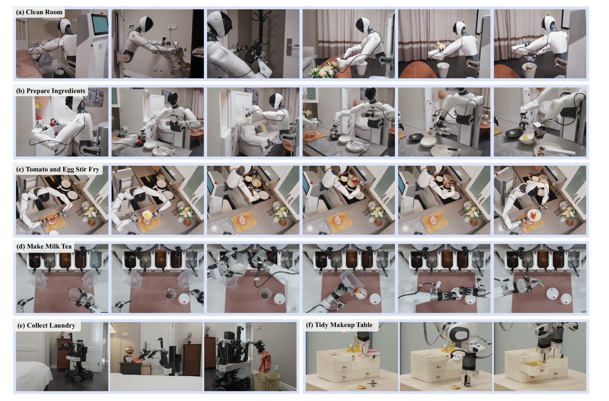
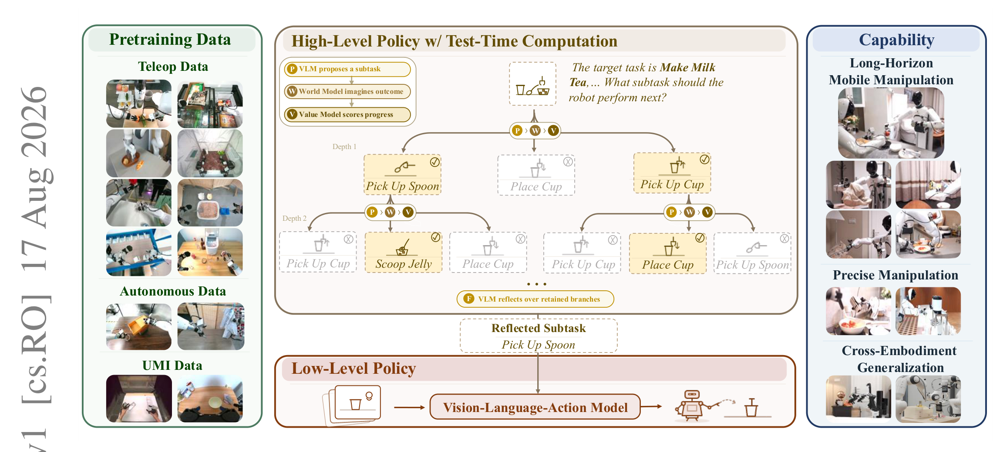
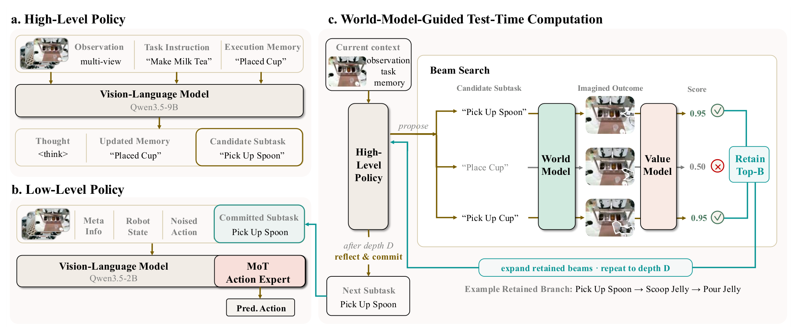
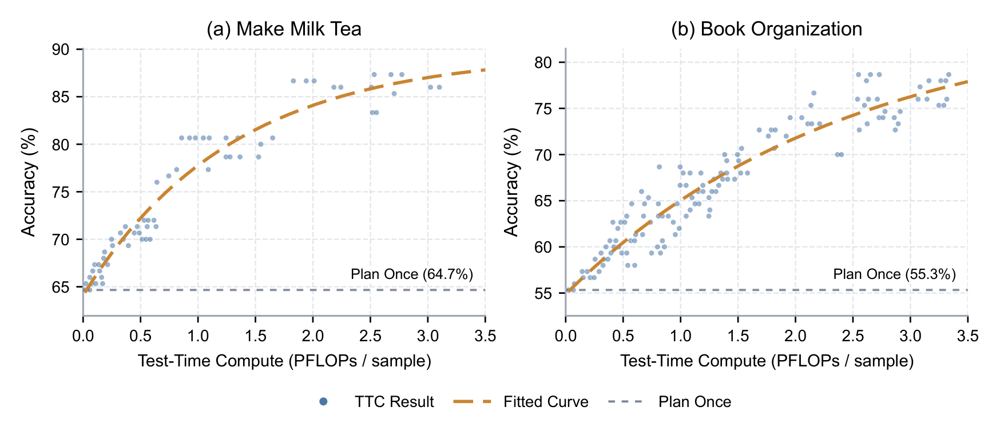

---
tags:
  - papers/robotics/vla
  - papers/embodied-ai
aliases:
  - tau0-VLA
  - tau_0-VLA
date: 2026-08-17
arxiv_id: "2608.16885"
---

# τ₀-VLA：由世界模型引导测试时计算的分层机器人基础模型

## 核心信息

- 标题: $τ_0$-VLA: a Hierarchical Robot Foundation Model with World-Model-Guided Test-Time Computation
- 标题翻译: 由世界模型引导测试时计算的分层机器人基础模型
- 作者: Xiaowei Cai 等（作者按字母排序）
- 机构: Shanghai Innovation Institute；Agibot Finch；香港中文大学
- 发表时间: 2026-08-17
- 发表渠道: arXiv
- arXiv: 2608.16885
- 论文链接: https://arxiv.org/abs/2608.16885
- 代码 / 项目: https://tau0-vla.github.io/
- 数据 / 资源: 40,115 小时异构真实世界机器人数据
- 论文类型: 机器人操作方法论文

## 原文摘要翻译

长程机器人操作要求机器人既能可靠执行单项技能，也能在延展任务中连贯地组织这些技能。多数分层视觉语言动作模型都以单次前向传播完成此类决策，因而无法为困难或关键的选择分配额外计算。本文提出 $τ_0$-VLA：一个分层机器人基础模型，它通过世界模型引导的测试时计算，把高层子任务生成表述为可随计算量扩展的推理问题。在每个推理步骤中，高层策略利用执行记忆生成一个子任务；必要时，它会在提交输出前搜索替代方案。随后，低层策略在多种机器人本体上执行生成的子任务。该策略采用多模态联合训练，在 40,115 小时异构真实世界数据上训练。在域内和分布变化场景中，分配更多测试时计算能显著提升下一子任务预测准确率；这些收益进一步转化为长程机器人操作中更高的闭环成功率。

## 创新点

1. **把“下一步做什么”变成可扩展的推理问题。** 它不再把高层子任务当作一次生成即提交的文本，而是在不确定时搜索多个子任务序列；计算预算可由分支数、束宽和搜索深度扩大。
2. **用视觉后果约束语言子任务搜索。** 每个候选先经世界模型得到预计终态，再由价值模型按全局任务进度评分。这避免纯语言规划只比较表述合理性、却不比较物理后果。
3. **将搜索与最终提交分离。** 反思模型读取保留分支的路径、预计图像和累积分数后生成最终子任务；它可以重用候选，也可以生成候选集合之外的表述，而非机械挑选最高分分支。
4. **把高层规划与跨本体低层控制接在统一接口上。** 低层策略使用统一的 40 维状态动作表示、通道掩码和条件流匹配，在移动、双臂和固定基座本体间复用。
5. **无需额外人工标注地训练记忆纠错。** 仅扰动输入记忆、保留演示中的正确记忆和子任务作为监督，使高层模型学会处理记忆滞后、超前和执行失败。

## 一句话总结

这篇论文真正的贡献不是单纯“给机器人加搜索”，而是把**自然语言子任务**选作介于动作级规划和纯语言推理之间的搜索单位，并用预测视觉后果来评估它；但目前证据只说明这套高层计算在少量任务与十次重复的实体试验中有效，尚不足以证明它已经解决开放环境下的长时程可靠规划。

## 研究问题

### 固定预算的高层决策为何不够

长程操作的失败常发生在语义阶段判断而不是末端轨迹：机器人可能非常准确地执行了一个错误的子任务。传统分层策略通常把当前观测、任务指令和历史直接映射为下一条子任务，既不比较替代方案，也不预估它们改变环境后的状态。错误往往在动作已经改变场景之后才被发现，重规划无法收回错误提交的代价。

论文的重述是：在每个高层决策点，应该先问“这个子任务若完成，环境会变成什么样；它是否把任务推进得更好”，并仅在模型不确定时为该问题投入额外计算。

### 为什么选择子任务而不是动作或纯文本链条

动作级搜索能处理局部控制歧义，但对分钟级任务的阶段后果过于短视；纯语言推理覆盖范围更长，却没有视觉物理约束。子任务位于两者之间：频率足够低，值得做搜索；持续时间又足够长，能诱发可区分的环境变化。因此世界模型预测的是“执行某个子任务后的终态图像”，不是逐帧模拟整段控制轨迹。

## 数据与任务定义

### 训练数据与监督形式

低层策略使用 40,115 小时真实世界异构数据，包含人工遥操作、自动策略轨迹和类似第一视角采集的数据，并插入视觉语言指令、空间推理和机器人感知样本以维持视觉语言骨干能力。附录进一步拆分为约 23.4 千小时内部演示与 16.7 千小时公共数据；内部数据覆盖多种人形、移动双臂和固定基座机器人。

高层监督来自已有任务指令、阶段描述、可执行子任务标注、分段演示和多视角视频。训练样本包含思考、记忆和子任务字段；记忆被故意构造为对齐、滞后、超前或失败后失真的版本，再以观测对齐的正确记忆为目标。这里的关键假设是已有演示和阶段边界足以提供可靠的“正确下一子任务”，而不是从稀疏最终成功信号中学习规划。

### 评测任务和度量

长程主评测包含房间清理（25 步）、食材准备（14 步）、番茄炒蛋（22 步）和奶茶制作（13 步），典型成功轨迹约为 3 至 10 分钟。论文还在收衣、梳妆台整理和图书整理上检查短程或跨本体能力。实体试验的成功率要求所有必需里程碑和终态均完成；进度指标根据先决关系图给里程碑 0、0.5 或 1 的信用，每个方法任务组合为 10 次独立试验。

*Fig. 3：实体机器人评测覆盖移动清理、食材准备、炒菜、奶茶、收衣和梳妆台整理等场景。*

开放环路高层评测使用子任务边界处的标注样本，比较预测与真值的即时物理状态转移是否等价。由于措辞可不同，论文让两个温度为零的语言模型裁判投票，分为等价、相邻和错误；只有等价计为正确。这减少了字符串匹配偏差，但也使指标依赖裁判模型、提示词和“等价”的操作性定义。

## 方法主线

### 机制流程

1. **构造高层输入并得到快速提案。** 输入为任务指令 $ell$、上一轮执行记忆 $M_{t-1}$、上一子任务 $z^star_{t-1}$ 和当前多视角观测 $o_t$。提案模型先把记忆与观测对齐，输出直接提案 $z_t^{\mathrm{dir}}$ 和新记忆 $M_t$；其生成置信度决定是否把该提案直接送入低层。
2. **在不确定时扩展候选。** 对每条保留分支，提案模型生成 $N$ 个候选子任务。世界模型以该分支的头部相机图像和候选为输入，预测子任务完成时的图像；价值模型再以全局任务、候选和预测图像为输入，输出进度质量分数。
3. **按累计价值保留路径并反思提交。** 每层将所有子节点按累计分数全局取前 $B$ 条，重复到深度 $D$。反思模型读取真实观测对齐的上下文和最终保留分支摘要，生成 $z_t^star$ 并送入低层；搜索内部的分支记忆不会覆盖持久执行记忆。
4. **低层生成动作并闭环更新。** 低层策略接收 $o_t$、本体状态 $s_t$、提交子任务 $z_t^star$ 和控制元数据 $eta$，输出动作块并执行；下一轮真实观测再进入记忆。部署时高层约每秒在后台更新缓存子任务，低层约以 30 赫兹持续读取缓存执行，避免高层搜索阻塞控制环。

*Fig. 1：从异构预训练数据、高层世界模型搜索到低层视觉语言动作执行的系统总览。*

*Fig. 2：高层提案与记忆更新、低层动作专家，以及世界模型引导束搜索的具体信息流。*

### 高层搜索的核心形式化

对候选子任务 $z$，世界模型和价值模型分别计算预计终态与候选质量：

$$
\hat{o}=W(\tilde{o},z), \qquad v=V(\ell,z,\hat{o})
$$

其中 $\tilde{o}$ 是根节点的真实头部图像或非根分支的预测终态。工程上，这意味着后续深度不再看真实视频，而是从上一层想象出的图像继续提案，因此深度收益会受世界模型误差累积限制。

一条子分支将父路径分数与本次评分相加，并在每层全局剪枝：

$$
S(b\oplus z)=S(b)+v(b\oplus z), \qquad Q_{t,d}=\operatorname{TopB}(A_{t,d},S)
$$

这不是独立地为每个父节点留前 $B$，而是把所有父节点的孩子一起排序。因此束宽真正表达的是全局保留多少条“预计进度较高”的子任务路径；其代价近似随深度呈 $N$ 后接 $B N$ 的多次提案、世界模型和价值模型调用增长。

### 不确定性路由与记忆

路由并未另训一个昂贵分类器，而是复用提案模型已生成的词元统计。论文以所有生成词元的平均概率和记忆字段的平均对数几率差与任务特定阈值比较；任一低于阈值时触发搜索。优点是快速路径没有额外模型调用，缺点是阈值需要为每项任务用保留集校准，跨任务迁移时可能成为脆弱点。

持久记忆 $M_t$ 只由提案模型更新，反思模型和搜索内候选的记忆均是分支局部变量。这一设计避免把“想象中的路径”写回真实执行历史；否则一次高分但未执行的候选会污染下一轮状态判断。

### 低层统一动作接口

异构本体的状态与动作都被编码为 40 维。不可用关节、末端执行器或底盘通道由掩码置零并从损失中排除；控制元数据指示本体、控制模式和是否启用全身控制。动作专家以条件流匹配从掩码高斯噪声生成长度 $H=30$ 的动作块，并在推理时做 10 次均匀欧拉更新。该接口的代价是训练数据和掩码实现必须严格一致，否则缺失通道可能被当成真实零值。

## 关键结果

### 长程任务：分层接口本身的收益

下表固定论文的观测和动作接口；前四行直接用完整任务指令驱动低层，最后一行为有高层但不做束搜索的单次规划。分层单次规划的平均成功率为 45.00%，高于直接执行的 $τ_0$-VLA 的 27.50%，平均进度从 80.10% 提升到 87.85%。这种对比支持“显式阶段表示有用”，但并不能单独证明增益完全来自记忆，因为子任务接口和高层生成同时改变了。

| 方法 | 房间清理 | 食材准备 | 番茄炒蛋 | 奶茶制作 | 平均成功率 | 平均进度 |
| --- | ---: | ---: | ---: | ---: | ---: | ---: |
| GR00T N1.7 | 0/10 | 1/10 | 0/10 | 0/10 | 2.50% | 45.29% |
| LingBot-VLA | 0/10 | 0/10 | 0/10 | 0/10 | 0.00% | 44.43% |
| π0.5 | 4/10 | 2/10 | 0/10 | 3/10 | 22.50% | 73.05% |
| $τ_0$-VLA | 4/10 | 2/10 | 0/10 | 5/10 | 27.50% | 80.10% |
| 分层单次规划 | 5/10 | 4/10 | 4/10 | 5/10 | 45.00% | 87.85% |

任务级模式也很有信息量：番茄炒蛋中加盐的视觉变化小，直接执行容易重复或遗漏；房间清理需要跨房间保留进度；而奶茶制作的剩余失败集中在盖盖和插吸管，说明高层规划改善不了接触密集的末端操作瓶颈。

### 测试时计算：开放环路与闭环链条

开放环路中，测试时计算在四个设置都取得最高下一子任务准确率。特别是分布外图书整理，单次规划为 50.0%，一次候选筛选为 57.5%，多步搜索和反思为 74.0%。这说明收益不只是“多采样后选高分”：一次筛选也调用同样的世界模型和价值模型，但缺少递归扩展与最终反思提交。

| 设置 | 单次规划 | 一次候选筛选 | 测试时计算 |
| --- | ---: | ---: | ---: |
| 奶茶制作 | 64.7% | 70.0% | 87.3% |
| 图书整理（域内） | 66.0% | 83.0% | 88.0% |
| 图书整理（分布外） | 50.0% | 57.5% | 74.0% |
| 房间清理 | 72.0% | 74.0% | 87.0% |

> [!figure] Fig. 4
> 建议位置：关键结果
> 放置原因：该图承载四个开放环路设置的主比较。
> 当前状态：重裁剪后仍混入相邻正文，达到一次裁剪上限；以上表保留完整数值证据。

闭环实体试验保持低层策略不变，仅切换高层是否搜索。奶茶制作从 5/10、91.92% 进度提升到 7/10、95.38%；图书整理从 6/10、66.67% 到 9/10、93.33%；房间清理从 5/10、94.80% 到 7/10、97.60%。因此论文至少在这三项任务上建立了“预测正确率提高，闭环完成也提高”的证据链，而不只是优化代理指标。

### 算力不是免费的单调红利

*Fig. 5：奶茶制作和图书整理中，更多测试时计算提高下一子任务准确率，但拟合曲线趋于饱和。*

曲线在低算力区上升快，随后接近平缓，支持“适度额外搜索有价值”的说法，却不支持“计算越多越好”。论文没有把每个点对应的分支数、束宽、深度和实际时延完整列出，也未报告在严格实时预算下的收益，因此该曲线更像机制证据而不是可直接用于部署的成本模型。

## 深度分析

### 真正贡献是什么

从系统角度看，最值得保留的不是某一个模型组件，而是一个闭环分工：记忆解决“已做过什么”，世界模型回答“若这样做会怎样”，价值模型回答“是否推进目标”，反思模型负责“基于比较后现在提交什么”，低层策略负责“怎样做”。这将高层决策的误差与低层控制误差拆开，使作者可以在固定低层策略时检验搜索的因果贡献。

### 为什么它在分布外图书整理上更显著

分布外初始书序不在高层训练中，单次视觉语言生成更容易依赖训练分布中的表面模式。测试时计算把每个交换候选的想象终态和全局进度显式放入评分，再扩展后续交换，因此对未见初始排列仍有可比较的后果链。相较之下，一次候选筛选只能看一步，不能判断某个局部合理的交换是否使后续排序无路可走。

### 论文实际证明了什么，以及没有证明什么

它证明的是：在作者定义的数据、任务、阈值和十次物理试验下，世界模型引导的多步子任务搜索优于单次规划，并且三项任务中的闭环收益方向一致。它没有证明世界模型的多步想象与真实物理长期一致；也没有证明当对象、相机、摩擦、执行器或任务语言显著变化时，搜索仍值得其延迟和算力。

另一个容易误读点是“跨本体泛化”。收衣和梳妆台结果说明统一低层接口可在几种本体上工作，但这些短程实验绕过了高层分解、记忆和测试时搜索；它们不能直接推出完整高层系统已跨本体泛化。

### 复现时最关键的工程点

1. 不应把搜索分支的记忆写回真实记忆；否则反事实预测会污染状态机。
2. 需要先定义清晰的可执行子任务边界和阶段终态，否则世界模型训练对与价值监督都会变得模糊。
3. 路由阈值、$N$、$B$、$D$ 与后台子任务刷新频率应被视为联合超参数，并记录端到端延迟，而不只报准确率。
4. 高层语义评测最好辅以人工抽检或任务执行回放，因为语言模型裁判的“相邻但不等价”边界会直接改变结论。

## 局限

1. **统计与覆盖有限。** 每个实体方法任务组合只有 10 次独立试验；任务为受控家庭场景，尚未覆盖更长时段、人类干预、动态障碍或开放物体集合。
2. **世界模型误差被搜索放大。** 更深的分支用预测图像继续提案，错误终态会改变后续候选和价值估计；论文展示了收益饱和，却没有报告深度增加后预测失真的定量诊断。
3. **路由依赖任务特定校准。** 词元概率和记忆字段的对数几率差是否真能跨任务反映“值得搜索”，仍未被系统地验证。
4. **搜索消融不完整。** 论文比较了一次候选筛选与完整测试时计算，但未独立报告反思模型、束宽、深度、分支数或价值模型误差的贡献，也未清晰列出退化设置。
5. **高层与低层瓶颈不同。** 对盖盖、插吸管等接触密集操作，增加高层计算并不能替代更好的视觉、力觉或局部控制闭环。

## 我的笔记

- 可复用想法：把测试时计算放在“语义子任务”而不是动作词元上，再用预测视觉终态作评分证据，是具身系统中较合理的计算分配点。
- 需要质疑的假设：价值模型能够从单张预测头部图像判断任务进度；遮挡、不可见状态和多步物理误差会让这个假设变弱。
- 值得复现的实验：固定总推理预算，比较自适应路由、随机路由、一次候选筛选和多步搜索，并同时记录成功率、进度、延迟和每次决策的模型调用数。
- 下一步阅读方向：对照能够预测不确定性或多视角未来状态的机器人世界模型，检查它们是否能降低深度搜索中的想象误差累积。

## 引用

- Cai, Xiaowei, et al. 2026. *$τ_0$-VLA: a Hierarchical Robot Foundation Model with World-Model-Guided Test-Time Computation.* arXiv:2608.16885. https://arxiv.org/abs/2608.16885
