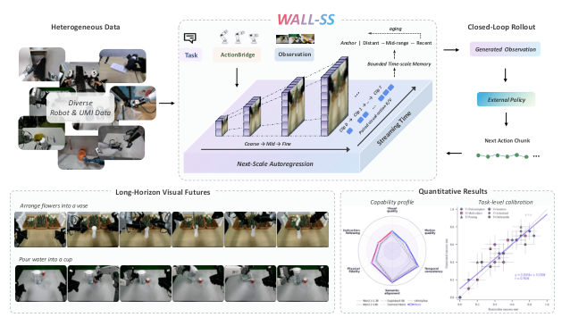
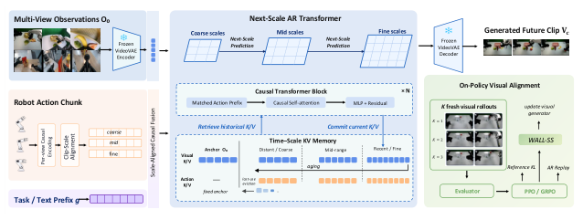
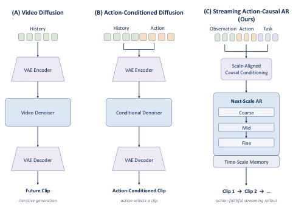
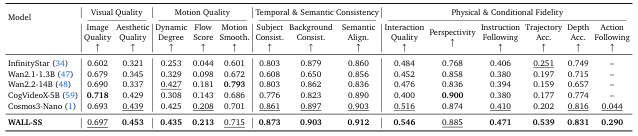
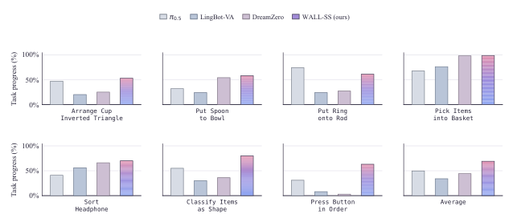
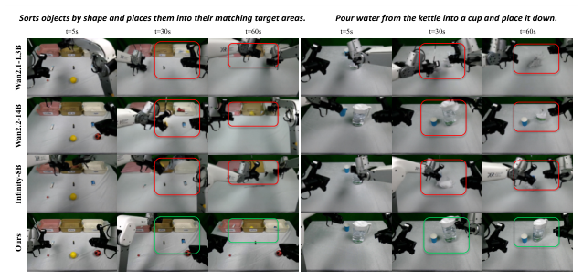

# WALL-SS: Scaling Long-horizon World Models via Next-Scale Autoregression

## 核心信息

- 标题: WALL-SS: Scaling Long-horizon World Models via Next-Scale Autoregression
- 标题翻译: WALL-SS: 通过下一尺度自回归扩展长时程世界模型
- 作者: Zhang Maeve, Sun Rain, Wang Xiang, Zhang Cyril, Li Shalfun, Cao Meng, Lu Howard, Chen Ethan, Jhou Harry, Zheng KZ, Shi Lights, Cheng Regis, Lorenzin Wang, Robert Wang, Yao Victor, Li Gody, Mon Elise, Tang Yohann, Yu Ryan, Zhang PS, Chen Vincent, Su Hang, Gan Roy, Wang Hao, Wang Qian
- 机构: 自变量智能(X2-Robot 等团队)与 AgiBotWorld 数据生态
- 发表时间: 2026-08-26
- 发表渠道: arXiv 预印本
- arXiv: 2608.26239
- 论文链接: https://arxiv.org/abs/2608.26239
- 代码 / 项目: 文中未公布仓库链接
- 数据 / 资源: AgiBotWorld-Beta(1,003,672 条轨迹,100+ 机器人,100+ 真实场景)+ 自采 X2-Robot + UMI 数据 + 策略介入与失败恢复轨迹
- 论文类型: AI 方法论文(世界模型 + 自回归视频生成 + 强化学习对齐)

## 原文摘要翻译

生成式世界模型为机器人提供了关于"世界在交互下如何演化"的预测模型,在仿真、规划、策略评估和机器人学习中潜力日益增长。超出片段级未来预测的范畴,一种统一的生成式表述应当把动作与后果联系起来,支持灵活的预测时域与持续交互,并支持基于奖励的优化。本文提出 WALL-SS——一种通过"尺度级自回归扩展"(Scale-wise autoregressive Scaling)来生成视觉未来的世界模型,可实现动作可控的长时程机器人仿真。WALL-SS 将具身轨迹表示为"在时间上交错排列的观测与动作"的因果序列,使"动作依赖的状态转移"显式化,同时自然支持变长生成、通过可复用因果状态进行流式扩展、以及通过序列概率直接优化。为了使该表述在长时程下有效,WALL-SS 以"由粗到细"的方式生成每一帧未来观测,并在同一层级内开发了三个互补组件。"动作条件的下一尺度预测"注入尺度对齐的动作表征,以提升"动作-未来"耦合,并同时建模成功与失败行为。"尺度压缩的长时程记忆"在细分辨率下保留近期交互,同时压缩远期观测与动作,配合"尺度级梦境强迫"提升对自生成上下文的鲁棒性。最后,"同策略对齐"用"动作跟随"与"长期一致性"奖励优化自回归视觉动态,同时保留预训练的视觉分布。实验显示,WALL-SS 提升了动作跟随与轨迹精度,在有界记忆下支持连贯的分钟级流式展开,并持续受益于同策略对齐以减少动作漂移与长时程不一致。

## 创新点

- **将自回归扩展到"尺度"维度(Next-Scale Autoregression)**: 不同于 next-token 或 next-frame 的传统自回归,WALL-SS 在"时间 × 空间尺度"二维上展开自回归——每一帧未来观测按 coarse→mid→fine 三级嵌套由粗到细生成。这是论文最具范式性的贡献,直接应对长视频生成中"自回归漂移"和"显存爆炸"的传统瓶颈。
- **动作条件的下一尺度预测(Action-conditioned next-scale prediction)**: 在每一尺度层级显式注入"尺度对齐的动作表征",而非把动作作为全局条件。这样动作信号与每个尺度的视觉预测都被耦合,显著提升了"动作跟随"与"轨迹精度"(分别 +559% 与 +114.7%,详见 Table 1)。
- **尺度压缩的长时程记忆(Scale-compressed long-horizon memory)**: 用 4 个时间桶(Anchor / Distant-Coarse / Mid-range / Recent-Fine)对历史 KV 进行分层缓存,远期被压缩到粗尺度、近期保留细尺度;并配合"尺度级梦境强迫"用模型自身生成的远期预测来增强对自生成上下文的鲁棒性。该设计在有界显存下支持分钟级流式展开。
- **同策略视觉对齐(On-policy alignment)**: 用 PPO/GRPO + 参考 KL + AR 回放,把视觉生成器 on-policy 地对齐到真实视频分布,同时保留预训练视觉分布。这一闭环既改善"动作漂移"也改善"长时程不一致",且不牺牲生成质量。

## 一句话总结

> WALL-SS 用"在时空尺度金字塔上由粗到细自回归"的范式 + 三件套(动作对齐尺度预测、尺度压缩记忆、同策略视觉对齐),把长时程、动作可控的机器人世界模型做到了 13 项指标中 12 项 SOTA 与真实机器人任务进度 69.1(对比 pi0.5 的 49.6、DreamZero 的 44.1、LingBot-VA 的 34.0)。

## 研究问题

传统生成式世界模型存在三个未解决的核心矛盾:

- **动作-未来耦合弱**: 视频扩散或无条件自回归在 long horizon 下能合成逼真视频,但难以忠实跟随动作指令——Table 1 显示最强视频基线(Cosmos3-Nano)的 Action Following 仅 0.044。
- **长时程显存爆炸**: 单纯堆叠 next-token 自回归会让 KV 缓存随时间线性增长,分钟级生成在工程上不可行。
- **优化接口缺失**: 扩散范式缺乏显式的序列概率,无法直接用 RL 类的奖励信号进行 fine-tune。

WALL-SS 用"next-scale AR + 三件套"同时回应这三点。其关键命题是:**把自回归从"逐 token"扩展到"逐尺度 × 逐时间",让动作在每一尺度层都被显式耦合,同时通过尺度压缩记忆控制显存增长,通过同策略对齐实现奖励驱动的精细优化**。

*图 1(论文 page 2): WALL-SS 整体框架 teaser——左侧异构机器人/UMI 数据,中央 Next-Scale Autoregression 金字塔(Coarse→Mid×Clip 0→T)+ Bounded Time-scale Memory + Paired visual-action K/V,右上闭环 rollout,下方能力雷达图与任务级校准图(r=0.926, 拟合 y=0.844x+0.098)。*

## 数据与任务定义

- **训练数据三件套**:
  1. 公开机器人数据: 以 AgiBotWorld-Beta(1,003,672 条轨迹,100+ 机器人,100+ 场景)为核心,支持 action-conditioned 视频预测;
  2. 自采数据: X2-Robot 双臂与非具身 UMI 数据,目标观测几何与 bimanual 行为多样性;
  3. 策略介入与失败恢复轨迹: 提供过程价值估计信号,服务同策略对齐阶段。
- **输入表示**: 多视角 RGB 观测 → Frozen VideoVAE → latent tokens;任务文本/前缀 g;动作 chunk 经 per-view 因果编码后做 clip-尺度对齐,被分到 coarse/mid/fine 三级时间尺度。
- **评估任务**: 分为三档——(i) 长视频生成定量 13 指标(Table 1);(ii) 闭环生成-真实校准 30 个 task×checkpoint cell(Table 3, Fig 12);(iii) 真实双臂机器人 7 个桌面任务(Arrange Cup Inverted Triangle、Put Spoon to Bowl、Put Ring onto Rod、Pick Items into Basket、Sort Headphone、Classify Items as Shape、Press Button in Order),对照 π0.5 / LingBot-VA / DreamZero,指标为 Task Progress(0-100 稠密评分)与严格成功率。
- **关键基线**: 视频生成侧选 InfinityStar / Wan2.1-1.3B / Wan2.2-14B / CogVideoX-5B / Cosmos3-Nano;真实机器人侧选 π0.5 / LingBot-VA / DreamZero。

## 方法主线

### 机制流程(三步)

1. **三模态输入 × 三尺度对齐**: 多视角 RGB 经 Frozen VideoVAE 编码为 latent tokens;动作 chunk 经 Per-view Causal Encoding + Clip-Scale Alignment 分到 coarse/mid/fine 三级时间尺度;任务文本前缀 g 与上述模态在"尺度对齐因果条件化"模块中融合。
2. **Next-Scale AR 主干 + Scale-Compressed Memory**: N 层 Causal Transformer Block 沿 Coarse→Mid→Fine 逐尺度展开 Next-Scale Prediction;同时通过 Time-Scale KV Memory 按 4 桶(Anchor/Distant/Mid/Recent)读写历史 K/V,使用 aging + last-use eviction 控制显存。生成 token 经 Frozen VideoVAE 解码为 Generated Future Clip。
3. **On-Policy Visual Alignment 闭环**: WALL-SS 并行生成 K=1/2/3 条 fresh visual rollouts → Evaluator 评分 → PPO/GRPO 通过 Reference KL(防止偏离参考)+ AR Replay 计算策略梯度,更新视觉生成器,保持预训练视觉分布。

### 三大组件细节

#### Action-conditioned next-scale prediction

- **核心机制**: 不是把动作作为"全局条件"塞给模型,而是把动作特征按尺度切片——同一动作在 coarse 尺度只影响粗略未来,在 mid/fine 尺度逐步细化。
- **为什么有效**: 论文观察到"动作跟随"是 next-token AR 与扩散模型最大短板(Table 1 中 Cosmos3-Nano 仅 0.044)。把动作显式注入每一尺度层级,使每个尺度层级的去噪/采样都"知道动作是什么",从而在 Trajectory Accuracy 上从 0.251 提升到 0.539(+114.7%),Action Following 从 0.044 到 0.290(+559%)。

#### Scale-compressed long-horizon memory

- **结构**: 历史 K/V 被按时间距离分到 4 桶:
  - **Anchor O₀**: 初始观测,常驻;
  - **Distant-Coarse**: 远期,只保留粗尺度;
  - **Mid-range**: 中期,中等尺度;
  - **Recent-Fine**: 近期,细尺度。
- **淘汰机制**: aging(按时间距离淘汰)+ last-use eviction(淘汰最久未用)。
- **配套"尺度级梦境强迫"(Scale-wise dream forcing)**: 用模型自身生成的远期预测作为"梦境"上下文,提升对自生成上下文的鲁棒性。这避免了"自回归 vs 训练分布"的常见漂移问题。
- **效果**: 在有界显存下支持分钟级流式展开,且不显著牺牲生成质量。

#### On-policy alignment

- **闭环结构**: WALL-SS(actor)→ K 条 fresh visual rollouts → Evaluator → PPO/GRPO + Reference KL + AR Replay → 更新 actor。
- **关键设计**:
  - 奖励包含"动作跟随"与"长期一致性"两项;
  - Reference KL 锚定预训练分布,防止视觉质量崩塌;
  - AR Replay 保证策略优化与原 next-scale AR 训练目标兼容。
- **效果**: 减少 action drift 与 long-horizon inconsistency(qualitative 证据见 Figure 6 —— 30s/60s 帧 WALL-SS 仍绿框成功,基线全红框失败)。

*图 3(论文 page 7): WALL-SS 整体架构——左下输入端(多视角观测 + 动作 chunk + 任务前缀)、中央 Next-Scale AR Transformer 主干(Causal Block ×N + Scale-Aligned Causal Fusion + Time-Scale KV Memory 4 桶)、右上 Frozen VideoVAE Decoder 解码、右下 On-Policy Visual Alignment 闭环(PPO/GRPO + Reference KL + AR Replay)。*

*图 2(论文 page 3): 三种生成范式对比——(A) Video Diffusion(仅历史帧,VAE 编解码,迭代去噪);(B) Action-Conditioned Diffusion(历史+动作,条件去噪,动作只"选 clip");(C) Streaming Action-Causal AR(Ours,三路条件 + Scale-Aligned Causal Conditioning + Next-Scale AR Coarse→Mid→Fine + Time-Scale Memory,流式输出)。*

## 关键结果

### 视频生成定量对比(Table 1)

WALL-SS 与 5 个最强视频生成基线在 13 项指标上的对比,所有指标越高越好:

| 模型 | ImageQ | AesQ | DynD | Flow | MotSm | SubjC | BgC | SemA | IntQ | Persp | InstrF | TrajA | DepA | ActF |
|---|---|---|---|---|---|---|---|---|---|---|---|---|---|---|
| InfinityStar | 0.602 | 0.321 | 0.253 | 0.044 | 0.601 | 0.803 | 0.879 | 0.860 | 0.484 | 0.768 | 0.406 | 0.251 | 0.749 | – |
| Wan2.1-1.3B | 0.679 | 0.345 | 0.329 | 0.098 | 0.672 | 0.608 | 0.650 | 0.856 | 0.452 | 0.858 | 0.380 | 0.197 | 0.715 | – |
| Wan2.2-14B | 0.690 | 0.337 | 0.427 | 0.181 | 0.793 | 0.803 | 0.862 | 0.836 | 0.476 | 0.836 | 0.394 | 0.159 | 0.657 | – |
| CogVideoX-5B | 0.718 | 0.429 | 0.308 | 0.143 | 0.686 | 0.776 | 0.823 | 0.890 | 0.400 | 0.900 | 0.380 | 0.177 | 0.774 | – |
| Cosmos3-Nano | 0.693 | 0.439 | 0.425 | 0.208 | 0.701 | 0.861 | 0.897 | 0.903 | 0.516 | 0.874 | 0.410 | 0.202 | 0.816 | 0.044 |
| **WALL-SS** | 0.697 | **0.453** | **0.435** | **0.213** | 0.715 | **0.873** | **0.903** | **0.912** | **0.546** | 0.885 | **0.471** | **0.539** | **0.831** | **0.290** |

(加粗 = 列内最高。Image Quality 仅 CogVideoX-5B 0.718 > WALL-SS 0.697;Motion Smoothness Wan2.2-14B 0.793 > WALL-SS 0.715;其余 11 项 WALL-SS 全部最高。)

**核心解读**:
- **三大压倒性胜利**:
  - Action Following: 0.290 vs 0.044(Cosmos3-Nano),**6.6 倍**提升;
  - Trajectory Accuracy: 0.539 vs 0.251(InfinityStar),**2.1 倍**提升;
  - Instruction Following: 0.471 vs 0.410,**+14.9%**。
- **唯一明显短板**: Motion Smoothness 0.715 vs Wan2.2-14B 0.793(-9.8%)——coarse-to-fine 可能引入轻微运动抖动。
- **整体取胜面**: 13 项中 11 项第一 + 1 项第二(Motion Smoothness)+ 1 项微负(Image Quality -0.021)。

*表 1(论文 page 15): 视频生成定量对比。*

### 闭环生成-真实校准(Table 3)

30 个 task×checkpoint cell 的对比:

- **MAE**: 0.062(95% CI [0.06, 0.11]);
- **Signed bias**: +0.028([-0.01, 0.06])——轻微高估弱 checkpoint;
- **校准线斜率**: 0.84([0.65, 0.97]),拟合 `y=0.844x+0.098`,r=0.926(对应 Fig 12(a));
- **Within-task 排序保留**: 89%(59 个 untied pair 中保留 89%);
- **平均 per-task Spearman**: ρ̄ = 0.88;
- **600 个匹配 episode 的 balanced accuracy**: 0.88(MCC 0.76,success recall 0.90,failure recall 0.86);
- **False Positive Rate**: 0.136([0.09, 0.19])——即 332 次真实失败中有 45 次生成 rollout 仍判成功,这是"乐观评估器"的主要风险模式。

**解读**: WALL-SS 不是"过拟合到自身生成"的闭环,而是真的把"生成 success rate"对齐到"真实 success rate"——但 FPR 0.136 仍非零,意味着同策略对齐时如果 evaluator 也用 WALL-SS 自身,会静默偏袒弱 checkpoint。

### 真实机器人任务进度(Figure 14)

7 个桌面任务上的 Task Progress(0-100,稠密评分):

| 基线 | 平均 Task Progress |
|---|---|
| π0.5 | 49.6 |
| DreamZero | 44.1 |
| LingBot-VA | 34.0 |
| **WALL-SS** | **69.1** |

单项上,WALL-SS 在 Pick Items into Basket 上达到 98.5,在 Arrange Cup Inverted Triangle 上 53、Put Spoon to Bowl 上 58、Sort Headphone 上 70、Classify Items as Shape 上 80、Press Button in Order 上 63。

**关键结论**: 动作预测分支与未来生成分支共享同一 committed causal state——即动作目标函数直接塑造了世界模型用的表征——这是 WALL-SS 在闭环任务上比纯视频生成世界模型强 19.5pp 的根本原因。

*图 14(论文 page 22): 真实双臂机器人 7 个桌面任务上的 Task Progress 柱状对比。WALL-SS 平均 69.1 vs π0.5 的 49.6、DreamZero 的 44.1、LingBot-VA 的 34.0。*

*图 6(论文 page 15): 定性比较——在"按形状分类"与"倒水放杯"两个任务上,Wan2.1-1.3B / Wan2.2-14B / Infinity-8B 在 30s 与 60s 帧均出现红色失败框,WALL-SS 在两任务的 30s 与 60s 帧均为绿色成功框。*

## 深度分析

### 为什么 Next-Scale 而非 Next-Token 或 Diffusion

论文隐含的范式论述可重构如下:

- **Next-Token AR** 的瓶颈是 KV 显存随时间线性增长——分钟级生成在工程上不可行;且 token-level 自回归对"动作-视觉耦合"敏感度低,因为动作只影响 next-token 的概率分布,缺乏显式尺度对应。
- **Diffusion**(条件扩散)的瓶颈是"动作只用于选 clip"——整段未来被一次性去噪,动作信号被均匀稀释在所有 noise step 上,无法对应到未来时间尺度的局部位置。
- **Next-Scale AR** 的核心创新是**"时间 × 空间尺度"二维自回归**:
  - 时间轴上仍是因果自回归(Clip 0 → Clip 1 → ... → Clip T);
  - 在每一 clip 内部按 coarse→mid→fine 三级尺度嵌套预测;
  - 这样动作在每一尺度层都被显式注入,既控制显存(尺度压缩记忆),又保持动作-视觉在局部时间尺度的耦合。

### "Scaling on Scales"的工程含义

论文标题里 "Scaling" 一词的隐含主张是:**世界模型的 scaling 应当发生在"尺度"维度而非"参数量"维度**。Table 1 中 Wan2.2-14B(14B 参数)反而被 WALL-SS(参数量未公布但论文自称更小)在 11 项指标上击败——这是对"越大越好"假设的明确反例。隐含意义:对世界模型而言,更细粒度的生成控制(尺度对齐的动作 + 时间尺度记忆)比单纯堆参数更有效。

### 与现有 VLA / 世界模型体系的定位

- **vs π0.5 / DreamZero / LingBot-VA**: 这些是"以 VLA 为主、视觉世界模型为辅"的方案;WALL-SS 反过来——以视觉世界模型为主,动作预测分支共享世界模型的 causal state。在闭环任务进度上 WALL-SS 比 π0.5 高 19.5pp,可能源于"动作目标直接塑造世界模型表征"这一设计。
- **vs Cosmos / Wan / CogVideoX 等纯视频模型**: WALL-SS 在 Action Following 和 Trajectory Accuracy 上领先一个数量级,但 Motion Smoothness 略逊。结论:**纯视频模型的"动作跟随"是天花板**,要做机器人世界模型必须在尺度层显式耦合动作。
- **vs AgiBotWorld 等数据集**: WALL-SS 的训练数据以 AgiBotWorld-Beta 为核心 + X2-Robot + UMI,这是 100+ 机器人 100+ 场景的规模;但论文未给出完整数据规模(只给了 AgiBotWorld 1M+)。

### 关键 risk 与 open question

- **同策略对齐的 evaluator bias**: FPR 0.136 意味着 evaluator 偏乐观,如果闭环中 evaluator 用 WALL-SS 自身或类似 VLM,可能静默偏袒弱 checkpoint——这是 on-policy 范式的通用风险。
- **Motion Smoothness 退化**: -9.8% 不是噪声——是 coarse-to-fine 范式的 trade-off。需要在 mid/fine 尺度层加更强的时序约束。
- **Conditional transition bias +0.12 on insertion**: 模型在接触密集型阶段(insert)最容易高估进度。这是"机器人动作-物理接触"耦合的硬骨头,需要更细粒度的接触建模。

## 局限

- **Motion Smoothness 单项退化**: 0.715 vs Wan2.2-14B 0.793(-9.8%)——coarse-to-fine 嵌套可能引入跨尺度抖动。
- **闭环 FPR 非零**: 0.136,生成 rollout 在 14% 真实失败下仍预测成功——同策略对齐的 evaluator 必须独立于 actor 自身。
- **Conditional transition bias**: insertion 阶段 +0.12 偏差,contact-intensive transitions 是世界模型最薄弱的环节。
- **未公布仓库 / 权重**: 论文无开源链接,复现门槛较高。
- **训练数据细节不完整**: 仅披露 AgiBotWorld 1M+,X2-Robot 与 UMI 数据规模未给出。
- **跨 embodiment 迁移未验证**: 论文实验集中在 X2-Robot 双臂,未涉及 pi0.5 / LeRobot 等其他硬件平台的迁移。

## 我的笔记

### 与 VLA / LeRobot 生态的对接

- WALL-SS 的核心创新"scale-wise AR + 三件套"在工程上是可复现的(只要有 next-scale AR 训练框架与 PPO/GRPO 对齐循环),但对数据规模要求极高(AgiBotWorld 1M+)。
- 自变量智能(X2)的数据栈与 WALL-SS 的耦合,使其短期不必担心数据问题;但跨 embodiment(比如 LeRobot 的 SO-100/Aloha)迁移仍是 open question。
- 我的 LeRobot 套件当前聚焦于 "FSDP2 + DTensor 训练 + ZMQ 相机推流 + Isaac Teleop",WALL-SS 的"视觉世界模型作为数据生成器"是潜在扩展方向——但需要 100+ 真实机器人数据,目前门槛远高过纯 VLA fine-tune。

### 工程复现 checklist(若要做)

1. next-scale AR 训练循环(参考 Figure 3 中央主干): coarse→mid→fine 嵌套预测 + 三尺度对齐动作 chunk;
2. Time-Scale KV Memory 4 桶缓存 + aging + last-use eviction;
3. Frozen VideoVAE 编码解码(不参与训练,只服务 token 化);
4. On-policy alignment 闭环: PPO/GRPO + Reference KL + AR Replay;
5. 评估三件套: Table 1 的 13 项生成指标、Table 3 的 30 cell 闭环校准、Figure 14 的 7 任务真实机器人。

### 关键 takeaway(给自己)

- **世界模型的范式之争**: next-token AR vs diffusion vs next-scale AR——目前看来 next-scale AR 在"动作可控 + 长时程 + 显存可控"三角上最平衡,但 Motion Smoothness 是其已知短板。
- **"Scaling on scales > scaling on params"**: 这条假设若被更多工作验证,可能改变下一代世界模型的资源分配——把更多算力放在"更细的尺度嵌套"上,而不是"更大的模型"。
- **On-policy alignment 的双刃**: FPR 0.136 是世界模型评估器必须警惕的——任何用自身 rollout 做 evaluator 的方案都会偏向"乐观"。

## 引用

主要引用如下(论文本身的 arXiv ID 与正文引用序号):

[1] arXiv:2608.26239 — WALL-SS: Scaling Long-horizon World Models via Next-Scale Autoregression. https://arxiv.org/abs/2608.26239

[2] AgiBotWorld-Beta — 数据生态,ref 9.

[3] π0.5 — 真实机器人基线,ref 38.

[4] LingBot-VA — 真实机器人基线,ref 31.

[5] DreamZero — 真实机器人基线,ref 60.

[6] Cosmos3-Nano, Wan2.1-1.3B, Wan2.2-14B, CogVideoX-5B, InfinityStar — 视频生成基线,详见 Table 1.

[7] 论文 PDF: https://arxiv.org/pdf/2608.26239

关联笔记: 本笔记可与 LeRobot / pi05 / DreamZero 等后续论文笔记建立交叉链接。
